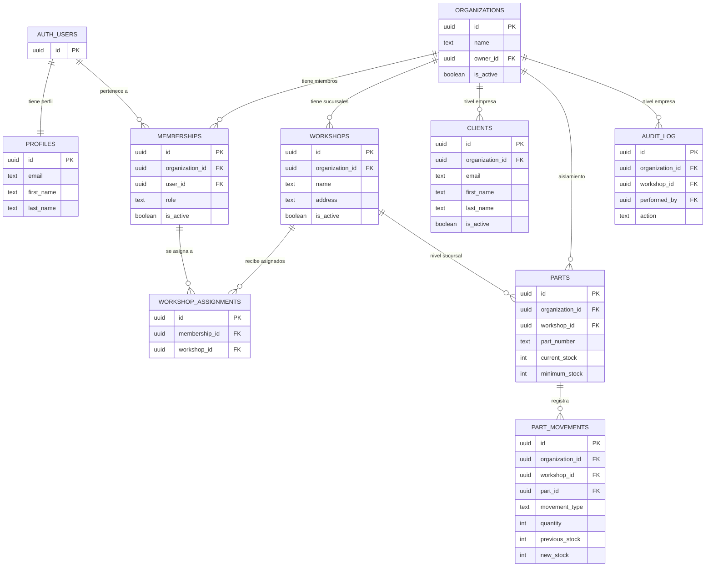

# Modelo de datos

Diseño de datos de la arquitectura multi-tenant jerárquica. Corresponde al objetivo específico 2 ([anteproyecto/01](anteproyecto/01-definicion-y-alcance.md) §1.7).

> Terminología: [Glosario](01-glosario.md) · Decisión de fondo: [ADR-006](07-decisiones-diseno.md) · Aislamiento: [Seguridad](06-seguridad.md)

## Diagrama entidad-relación

## Principio rector

**Toda tabla de negocio lleva `organization_id`**, incluidas las de nivel sucursal. Esto permite que las políticas de aislamiento se evalúen siempre sobre el mismo criterio, sin importar el nivel jerárquico del dato. Las tablas de nivel sucursal llevan **además** `workshop_id`.

## Tablas

### Identidad

| Tabla | Descripción | Claves y restricciones |
|---|---|---|
| `auth.users` | Gestionada por el proveedor de identidad. Identidad global de la cuenta. | PK `id` |
| `profiles` | Datos de perfil, 1:1 con la cuenta. Se crea por disparador al registrarse. | PK `id` → `auth.users(id)` en cascada |

### Jerarquía organizacional

| Tabla | Nivel | Claves y restricciones |
|---|---|---|
| `organizations` | — (es el tenant) | PK `id`; `owner_id` → `auth.users(id)`; índice por `owner_id` |
| `workshops` | Empresa | PK `id`; `organization_id` → `organizations(id)` en cascada; único `(organization_id, name)`; índice por `organization_id` |
| `memberships` | Empresa | PK `id`; **único `(organization_id, user_id)`**; `role ∈ {owner, mechanic, receptionist}`; índices por `user_id` y por `organization_id` |
| `workshop_assignments` | Empresa | PK `id`; único `(membership_id, workshop_id)`; ambas FK en cascada |

### Negocio — corte vertical

| Tabla | Nivel | Claves y restricciones |
|---|---|---|
| `clients` | **Empresa** | PK `id`; `organization_id` FK; **único `(organization_id, email)`**; índice por `organization_id` |
| `parts` | **Sucursal** | PK `id`; `organization_id` + `workshop_id` FK; **único `(workshop_id, part_number)`**; índice por `(organization_id, workshop_id)` |
| `part_movements` | **Sucursal** | PK `id`; `organization_id` + `workshop_id` + `part_id` FK; **inmutable** (solo inserción); índices por `part_id` y por fecha |
| `audit_log` | **Empresa** | PK `id`; `organization_id`; `workshop_id` nullable; `performed_by` **sin FK real**, para que el registro sobreviva al borrado del usuario |

### Convenciones comunes

- **Identificadores**: UUID generado por la base de datos.
- **Marcas de tiempo**: `created_at` con valor por defecto del servidor; `updated_at` nullable, gestionado por la aplicación.
- **Baja lógica**: `is_active` en las entidades que deben conservar historial (`organizations`, `workshops`, `memberships`, `clients`, `parts`).
- **Historial inmutable**: `part_movements` y `audit_log` solo admiten inserción; nunca se actualizan ni se borran.

## Efecto de la jerarquía en las restricciones de unicidad

El nivel de cada entidad determina el ámbito de sus claves únicas — es la consecuencia más visible de ADR-006:

| Restricción | Ámbito | Consecuencia práctica |
|---|---|---|
| Email de cliente | `(organization_id, email)` | Dos empresas distintas pueden tener el mismo cliente. Dos sucursales de la **misma** empresa, no: es el mismo cliente. |
| Número de parte | `(workshop_id, part_number)` | La misma pieza puede existir en varias sucursales, cada una con su propia existencia. |
| Miembro | `(organization_id, user_id)` | Una cuenta tiene un solo rol por empresa, aunque trabaje en varias sucursales. |
| Nombre de sucursal | `(organization_id, name)` | No puede haber dos sucursales con el mismo nombre en una empresa. |

## Políticas de aislamiento (RLS)

Todas las tablas de negocio activan Row-Level Security. Las políticas se apoyan en dos funciones auxiliares que se ejecutan con privilegios definidos por el creador, para evitar recursión al consultar `memberships` desde una política:

| Función | Devuelve |
|---|---|
| `is_org_member(org)` | Verdadero si la cuenta autenticada tiene membresía **activa** en esa empresa |
| `is_org_owner(org)` | Verdadero si además su rol es `owner` |

**Patrón aplicado**

| Operación | Regla |
|---|---|
| Lectura | `is_org_member(organization_id)` |
| Escritura de datos de negocio | `is_org_member(organization_id)` + verificación de rol en la capa de aplicación |
| Administración (sucursales, miembros) | `is_org_owner(organization_id)` |

Las tablas de nivel sucursal usan **la misma condición sobre `organization_id`**: la pertenencia del `workshop_id` a la empresa activa se valida en la API, no en la política. Esta separación mantiene las políticas simples y auditables (ver [ADR-006](07-decisiones-diseno.md)).

## Reglas de negocio con impacto en los datos

| Regla | Descripción |
|---|---|
| Cálculo de existencias | `compra`, `devolución` y `transferencia de entrada` suman; `venta` y `merma` restan; `ajuste` **fija** un valor absoluto. Una operación que dejaría la existencia negativa se rechaza. |
| Atomicidad del movimiento | La inserción del movimiento y la actualización de la existencia del repuesto deben ocurrir en una sola transacción. |
| Registro inicial de stock | Al crear un repuesto con existencia inicial mayor a cero, se genera automáticamente un movimiento de entrada que lo justifica. |
| Protección del propietario | No se puede cambiar el rol ni remover al `owner_id` de la empresa. |
| Transferencia entre sucursales | Genera dos movimientos vinculados (salida en origen, entrada en destino), ambos en la misma transacción y dentro de la misma empresa. |

## Evolución del esquema

El esquema se construye mediante **migraciones versionadas** (RNF-304): cada cambio es un archivo aplicable de forma reproducible, lo que permite reconstruir la base desde cero y mantener alineados los entornos de desarrollo y despliegue. El orden de construcción sigue la dependencia entre entidades —identidad y jerarquía primero, entidades de negocio después— y se detalla en el cronograma ([08-plan-trabajo.md](08-plan-trabajo.md)).
