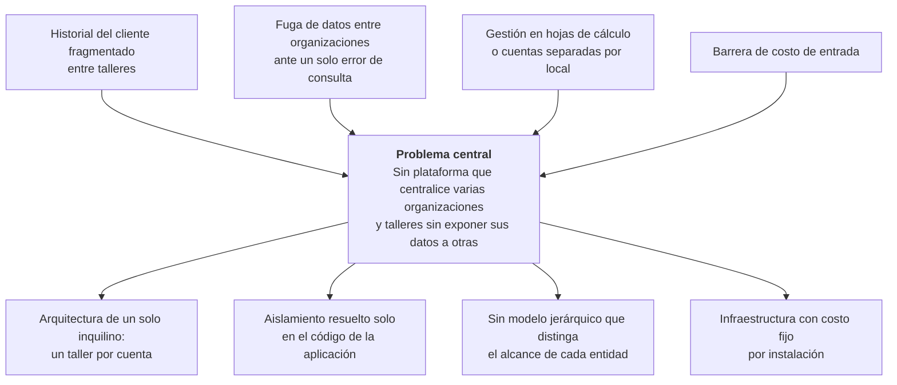

# 1. Definición y Alcance del Proyecto

## 1.1 Tema

**Título del proyecto**

> **Diseño y validación de una arquitectura multi-tenant jerárquica con RLS para aislamiento verificable e inmutable en mantenimiento mecánico**

**Formulación extendida del tema.** Diseño, desarrollo y validación de una arquitectura multi-tenant jerárquica (organización → talleres) cuyo aislamiento de datos se aplica en el motor de base de datos mediante seguridad a nivel de fila, reforzada por verificación de membresía en la capa de aplicación y desplegada sobre infraestructura serverless. El aislamiento es **verificable** porque se comprueba por dos vías independientes, e **inmutable** porque se sostiene aun cuando la capa de aplicación omite sus controles. La arquitectura se dirige al servicio de mantenimiento mecánico y se valida sobre el servicio de **motocicletas en Bolivia** (§1.3).

> El **título** es la forma canónica y se emplea en portada, índices y referencias a este proyecto. Nombra tecnología (arquitectura multi-tenant jerárquica con RLS), objeto de estudio (aislamiento verificable e inmutable) y dominio de impacto (mantenimiento mecánico). Nombra las dos operaciones que producen conocimiento —diseñar y validar—; el desarrollo, que el objetivo general sí nombra, es la fase que construye el artefacto sobre el que se valida (§1.7).

## 1.2 El problema

El problema se formula como **árbol**: de los efectos observables se asciende al problema central, y de este se desciende hasta causas que son **decisiones de ingeniería concretas**, no intuiciones.

### Efectos

| Efecto observable | Evidencia empírica |
|---|---|
| El historial del cliente queda fragmentado entre talleres de una misma organización | Relevamiento de 10 plataformas: la gestión de varias organizaciones desde una cuenta está **ausente** en la oferta local ([Análisis del mercado](../ingenieria/09-analisis-mercado.md)) |
| Un solo error de consulta expone datos de una organización a otra | Fallos recurrentes documentados en la aplicación de políticas de seguridad de fila y fuga de información por tiempo de ejecución de la consulta (§2.2) |
| El operador que crece lleva cada local como una cuenta independiente o recurre a hojas de cálculo | Caracterización del sector (§2.1.1) |
| El costo de entrada excluye a buena parte del sector | Empleo informal del 86,8 % de la población ocupada y presupuesto de tecnología reducido (§2.1.1) |

### Problema central

Los operadores que gestionan **varias organizaciones y talleres de servicio de mantenimiento mecánico** no disponen de un sistema que centralice su información sin exponerla a otras organizaciones: el software disponible es de un solo inquilino y, cuando separa datos entre clientes del sistema, lo hace **únicamente en el código de la aplicación**.

### Causas raíz

| # | Causa raíz — decisión de ingeniería | Consecuencia |
|---|---|---|
| 1 | **Arquitectura de un solo inquilino**: el software relevado con presencia en Bolivia (AutoSoft Taller, ServitechApp, TuneraTaller) y el regional (Appli-Car, Garage App) asume un taller por cuenta | No modela ni la pertenencia de varias organizaciones a una cuenta ni la de varios talleres a una organización |
| 2 | **Aislamiento solo en la capa de aplicación**: el filtro por cliente del sistema se escribe en cada consulta | Basta que una consulta omita el filtro para que se produzca una fuga: no hay ningún control por debajo que lo impida |
| 3 | **Ausencia de un modelo jerárquico** que distinga qué entidades pertenecen a la organización y cuáles al taller | Centralizar obliga a elegir entre fragmentar al cliente o mezclar el inventario de locales distintos |
| 4 | **Infraestructura con costo fijo por instalación** —servidor propio, despliegue manual— | El costo de entrada no se adapta a unidades de negocio pequeñas |

## 1.3 Delimitación del problema

> **Por qué el título dice «mantenimiento mecánico» y la delimitación contextual dice «motocicletas».** El título declara el **dominio de aplicabilidad** de la arquitectura: nada de lo que se diseña es propio de la motocicleta, y el mismo modelo sirve a cualquier taller de servicio mecánico. La delimitación contextual fija **dónde se valida**: el servicio de motocicletas en Bolivia, que es el caso del que se dispone de datos oficiales (§2.1.1), de oferta relevable (§2.2) y de operadores a los que someter la evaluación de usabilidad (§16.4 del anteproyecto). Un título más estrecho prometería menos de lo que la arquitectura sostiene; una delimitación más ancha prometería una validación que no se hace.

Las cuatro dimensiones son obligatorias:

| # | Dimensión | Delimitación |
|---|---|---|
| 1 | **Temática / tecnológica** | La capa de **identidad, jerarquía organizacional y aislamiento de datos** de un sistema web multiorganización: TypeScript en servidor (Node.js, Hono, Zod) y cliente (React), PostgreSQL con seguridad a nivel de fila sobre Supabase, y funciones serverless en Vercel. El detalle por capa está en §1.8.2 |
| 2 | **Contextual** | Organizaciones de servicio y reparación de motocicletas en Bolivia cuyos operadores administran —o planean administrar— más de una organización y/o más de un taller |
| 3 | **Temporal** | Septiembre a diciembre de 2026. La recolección de las métricas de validación ocurre en la iteración I8 (8 al 21 de diciembre de 2026); la decisión sobre los objetivos complementarios, el 23 de noviembre (objetivo 5) y el 7 de diciembre (objetivo 6). El cronograma está en el [Plan de trabajo](../ingenieria/08-plan-trabajo.md) |
| 4 | **Límites y exclusiones** | Lo que el desarrollo **no** abarca está enumerado en §1.8.3. Esa lista cerrada es la que garantiza la viabilidad del proyecto |

## 1.4 Pregunta general

> **¿De qué manera una arquitectura multi-tenant jerárquica con Row Level Security (RLS) sobre infraestructura serverless sostiene un aislamiento verificable e inmutable —cero filas ajenas devueltas aun cuando la capa de aplicación omite sus controles—, frente al aislamiento resuelto solo en la aplicación, en la gestión centralizada de varias organizaciones y talleres de servicio de mantenimiento mecánico en Bolivia?**

La pregunta se estructura como **tecnología** (arquitectura multi-tenant jerárquica con RLS) + **efecto esperado** (aislamiento verificable e inmutable) + **magnitud** (cero filas ajenas devueltas) + **condición** (aun cuando la capa de aplicación omite sus controles) + **contexto** (gestión centralizada de organizaciones de mantenimiento mecánico en Bolivia), contrastada con la alternativa que hoy emplea el mercado: el aislamiento resuelto solo en la aplicación. Es directamente resoluble construyendo el sistema y midiendo sobre él.

## 1.5 Preguntas específicas

*(Una por cada objetivo específico de §1.7, en el mismo orden.)*

1. ¿Qué estrategias de aislamiento multi-tenant documenta la literatura, con qué limitaciones, y qué carencias presentan las soluciones de gestión de talleres disponibles en Bolivia frente al modelo multiorganización? *(Diagnóstico)*
2. ¿Qué modelo de datos, qué políticas de seguridad a nivel de fila y qué contrato de interfaz permiten representar la jerarquía organización → talleres sosteniendo un único límite de aislamiento? *(Diseño)*
3. ¿Cómo se construye el corte vertical del sistema sobre infraestructura serverless de modo que conserve el diseño de aislamiento y quede verificado en cada integración? *(Desarrollo)*
4. ¿En qué medida la arquitectura propuesta reduce las filas ajenas devueltas frente a la línea base de aislamiento solo en la aplicación, y se sostiene esa reducción con la verificación de membresía deshabilitada? *(Validación)*
5. ¿Resulta el cambio de contexto entre organizaciones y talleres más eficiente y satisfactorio para el operador que el cambio de cuenta que exige el software de un solo inquilino? *(Complementaria)*
6. ¿Cuál es el costo operativo mensual por organización del despliegue serverless frente a un despliegue en servidor dedicado? *(Complementaria)*

## 1.6 Objetivo general

> **Diseñar, desarrollar y validar una arquitectura multi-tenant jerárquica con Row Level Security (RLS) sobre infraestructura serverless que sostenga un aislamiento verificable e inmutable —cero filas ajenas devueltas aun cuando la capa de aplicación omita sus controles—, para que los operadores de varias organizaciones y talleres de servicio de mantenimiento mecánico gestionen su información de forma centralizada.**

El objetivo sintetiza **qué** se construye (la arquitectura multi-tenant jerárquica con RLS sobre infraestructura serverless), **para quién** (los operadores de varias organizaciones y talleres de mantenimiento mecánico) y **con qué impacto** (cero filas ajenas devueltas y gestión centralizada). Las tecnologías concretas que lo materializan se declaran en el alcance técnico (§1.8.2) y no en el enunciado: son medios sustituibles, y atarlos aquí envejecería la formulación.

## 1.7 Objetivos específicos

### 1.7.1 Objetivos núcleo

Cuatro objetivos secuenciales, uno por fase metodológica —**Diagnosticar → Diseñar → Desarrollar → Validar**—, cada uno correlativo a una pregunta de §1.5 y cerrado con un entregable verificable. Se acotan deliberadamente: cada uno compromete lo mínimo necesario para responder la pregunta general, y ninguno depende de los objetivos complementarios.

1. **Diagnosticar** las estrategias de aislamiento multi-tenant documentadas en la literatura y las capacidades de las soluciones de gestión de talleres con presencia en Bolivia, para identificar el vacío que justifica el proyecto y fijar como línea base el aislamiento resuelto solo en la capa de aplicación.

2. **Diseñar** el modelo de datos de la jerarquía organización → talleres, las políticas de seguridad a nivel de fila y el contrato de la interfaz de programación que sostienen un único límite de aislamiento entre organizaciones.

3. **Desarrollar** el corte vertical del sistema —identidad, organizaciones, talleres, miembros, clientes e inventario— sobre el diseño del objetivo 2, con integración continua.

4. **Validar** el aislamiento mediante pruebas automatizadas por la interfaz de programación y por acceso directo a la base de datos, contrastando la arquitectura propuesta con la línea base y comprobando que la separación se sostiene con la verificación de membresía deshabilitada.

### 1.7.2 Objetivos complementarios — evaluables y descartables

Dos objetivos adicionales, **ya problematizados** en §1.2 —el cambio de cuenta que impone el software de un solo inquilino y la barrera de costo—, que amplían la evidencia sin condicionar la tesis. Cada uno lleva un **criterio de continuidad** que se evalúa en una fecha fija: si no se cumple, el objetivo se descarta de forma explícita, y su descarte no afecta la hipótesis (§10 del anteproyecto) ni el criterio de cierre del proyecto.

| # | Objetivo complementario | Criterio de continuidad | Fecha de decisión | Si se descarta |
|---|---|---|---|---|
| 5 | **Evaluar** con operadores del rubro la usabilidad del cambio de contexto entre organizaciones y talleres, frente al cambio de cuenta que exige el software de un solo inquilino | Al menos **30 operadores** confirmados para las sesiones de I8 | 23 de noviembre de 2026 (cierre de I6) | Lo recolectado se reporta como hallazgo exploratorio, con estadística descriptiva y sin inferencia |
| 6 | **Evaluar** el costo operativo mensual por organización del despliegue serverless frente a un despliegue en servidor dedicado | Los proveedores exponen métricas de consumo suficientes —invocaciones, transferencia de datos y tamaño de base— para imputar un costo por organización | 7 de diciembre de 2026 (cierre de I7) | El costo queda tratado solo como análisis de viabilidad económica en el [Plan de trabajo](../ingenieria/08-plan-trabajo.md) |

> La evaluación de usabilidad se acota al **cambio de contexto**, que es la consecuencia visible de la jerarquía de dos niveles: no se estudia la interfaz en general, sino si el modelo que propone la tesis resulta operable para quien debe usarlo.

### 1.7.3 Trazabilidad objetivo → pregunta → entregable

| # | Objetivo | Pregunta | Entregable verificable |
|---|---|---|---|
| 1 | Diagnosticar la literatura y la oferta boliviana | 1 | Matriz del estado del arte por autor, metodología, aporte y limitaciones (§2.2) · análisis del mercado · enunciado del vacío (§2.3) · definición operativa de la línea base |
| 2 | Diseñar el modelo, las políticas y el contrato | 2 | Especificación de requerimientos —actores, requisitos funcionales, reglas de negocio y no funcionales— · modelo entidad-relación con alcance por nivel · políticas de seguridad a nivel de fila y funciones de verificación especificadas · diagramas C4 de contenedores y componentes · contrato de la interfaz de programación |
| 3 | Desarrollar el corte vertical | 3 | Sistema desplegado en *staging* con el corte vertical operativo · pipeline de integración continua en verde · cobertura de pruebas ≥ 80 % en los servicios de dominio del servidor |
| 4 | Validar el aislamiento frente a la línea base | 4 | Suite de aislamiento con su matriz requisito → caso → evidencia · resultados de las condiciones C0 a C3 en tres corridas reproducibles desde una base vacía |
| 5 | Evaluar la usabilidad del cambio de contexto *(complementario)* | 5 | Informe de usabilidad: tasa de éxito por tarea, puntuación SUS con su α de Cronbach y contraste de tiempos frente al cambio de cuenta |
| 6 | Evaluar el costo operativo *(complementario)* | 6 | Estimación del costo mensual por organización en *staging* y producción, frente al servidor dedicado de referencia |

## 1.8 Alcance

El alcance se declara en dos listas separadas: la **funcional** dice *qué* hace el sistema; la **técnica**, *cómo* se construye y opera.

### 1.8.1 Alcance funcional

- Registro que crea una cuenta, su primera organización y su primer taller, con el usuario como Owner.
- Creación de organizaciones adicionales bajo la misma cuenta, y de talleres adicionales dentro de cada organización.
- Listado de las organizaciones del usuario según su membresía, cambio de organización activa y selección de taller activo.
- Gestión de miembros por organización —invitar, cambiar rol, remover—, reservada al rol Owner, y asignación operativa de miembros a talleres.
- **Corte vertical de demostración**: **Clientes** (entidad de nivel organización, visible desde cualquier taller) e **Inventario de repuestos** (entidad de nivel taller, acotada a su local). Son el mínimo necesario para demostrar y validar que el alcance por nivel funciona, y se eligen porque no dependen de otros módulos de negocio.
- Registro auditable del conjunto acotado de acciones críticas y su consulta reservada al Owner.
- Verificación de aislamiento: una cuenta sin membresía activa en una organización no puede leer ni escribir sus datos por ninguna vía.
- **Evaluación de usabilidad del cambio de contexto** con operadores del rubro *(objetivo complementario 5)*.
- **Medición del costo operativo** de los entornos desplegados *(objetivo complementario 6)*.

Los casos de uso, historias de usuario, reglas de negocio y criterios de aceptación por módulo están en [Requisitos](../ingenieria/02-requisitos.md) y [Historias de usuario](../ingenieria/03-historias-usuario.md).

### 1.8.2 Alcance técnico

| Capa | Tecnologías | Entregable verificable |
|---|---|---|
| **Frontend** | React con TypeScript, integración con el proveedor de identidad, selectores de organización y taller activos, manifiesto de aplicación instalable | Interfaz responsiva e instalable como PWA |
| **Backend** | Node.js, TypeScript, Hono (marco de la interfaz de programación) y Zod (validación) | Interfaz REST conforme al [contrato](../ingenieria/10-contrato-api.md), con su descripción OpenAPI |
| **Persistencia e identidad** | Supabase: PostgreSQL con seguridad a nivel de fila, Supabase Auth y migraciones versionadas | Modelo entidad-relación con políticas activas en las siete tablas de negocio |
| **Despliegue** | Vercel (funciones serverless) sobre dos entornos —*staging* y producción— y un proyecto de base de datos dedicado y desechable para la validación | Entornos desplegados y reconstruibles desde el repositorio |
| **Pruebas** | Vitest (unitarias, de contrato, de integración y de aislamiento) y Playwright (flujos extremo a extremo del cambio de contexto, instalabilidad y diseño responsivo) | Suite multinivel con cobertura ≥ 80 % en los servicios de dominio del servidor |
| **Integración y despliegue continuos** | GitHub Actions: verificación de tipos, pruebas, cobertura y auditoría de dependencias en cada integración; la integración de Vercel publica la rama `main` en *staging* y la rama `release` en producción tras superar el pipeline | Pipeline en verde en cada integración; ninguna publicación sin pipeline aprobado |

> Las teorías, modelos y estándares que justifican cada una de estas elecciones se desarrollan en el [Marco teórico y conceptual](03-marco-teorico-y-conceptual.md); las alternativas evaluadas y descartadas, en [Decisiones de diseño](../ingenieria/07-decisiones-diseno.md) y en la matriz de selección tecnológica de [Arquitectura](../ingenieria/04-arquitectura.md).

### 1.8.3 Exclusiones (lo que explícitamente NO cubre este proyecto)

El objeto de estudio es la **arquitectura**, no la suite funcional completa. En consecuencia, **no** forman parte de este proyecto:

- **Los módulos operativos fuera del corte vertical**: motocicletas, órdenes de trabajo, historial de mantenimiento y panel de métricas. Se construyen solo Clientes e Inventario, por ser suficientes para demostrar los dos niveles de la jerarquía (§1.8.1); el resto queda como trabajo posterior reutilizando el mismo patrón.
- **La auditoría extendida al conjunto de las entidades de negocio.** Sí forma parte del alcance el registro del conjunto acotado de acciones críticas que enumera RF-703 ([Requisitos](../ingenieria/02-requisitos.md)).
- **La integración con WhatsApp Business API.**
- **La emisión de factura electrónica del SIN** de Bolivia. Se documenta como requisito del mercado, pero su construcción excede el alcance temporal.
- **Aplicaciones móviles o de escritorio nativas**: solo web responsiva e instalable.
- **Migración de datos productivos** desde sistemas anteriores: no existen datos productivos previos.
- **Pruebas de carga, estrés o rendimiento a escala productiva.** El dominio no las justifica —un sistema de gestión interna de talleres, sin tráfico masivo ni exigencia de latencia estricta— y fijar un umbral que el problema no exige inflaría el alcance sin aportar valor (RNF-501).
- **Contenedores e infraestructura como código**: el despliegue serverless gestionado no los requiere.
- **Pruebas de penetración** y **mitigación del canal lateral temporal** de la seguridad a nivel de fila: el alcance cubre el aislamiento de contenido entre organizaciones, no una evaluación de seguridad ofensiva.
- **La evaluación de usabilidad de la totalidad de la interfaz.** Se evalúa el cambio de contexto entre organizaciones y talleres (§1.7.2); las demás pantallas quedan fuera.

## 1.9 Justificación

### Técnica

El proyecto aporta una solución replicable a un problema conocido de la industria del software como servicio: sostener el aislamiento entre inquilinos en un esquema compartido sin que dependa de que cada consulta esté bien escrita. Lo resuelve situando el control en el motor de base de datos, reforzándolo con una verificación independiente en la aplicación, y extendiéndolo a un inquilino **jerárquico** —organización con varios talleres— cuyas entidades no comparten el mismo alcance. El patrón es aplicable a cualquier sistema multiorganización de esquema compartido, con independencia del rubro.

### Económica / de negocio

El despliegue serverless, con escalado a cero y sin costo fijo por organización, reduce el costo de infraestructura a lo que se consume, condición necesaria para ofrecer software especializado a un sector con alta informalidad y presupuesto de tecnología mínimo (§2.1.1). Administrar varias organizaciones y talleres desde una sola cuenta elimina, además, la duplicación de licencias y registros que hoy impone el software de un solo inquilino. El objetivo complementario 6 cuantifica ese costo por organización.

### De conocimiento

El proyecto documenta un procedimiento reproducible para **verificar** el aislamiento multi-tenant, no solo para afirmarlo: dos vías independientes de comprobación, una línea base contra la que se contrasta, un escenario de datos construido por la propia prueba y una matriz que traza cada requisito hasta su evidencia. La suite y su evidencia quedan disponibles como referencia reutilizable por la comunidad técnica para evaluar otros sistemas de esquema compartido.
