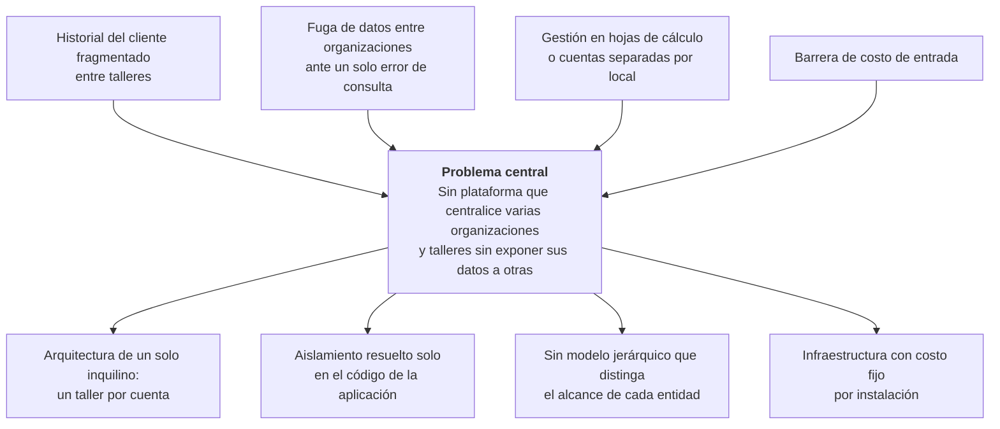
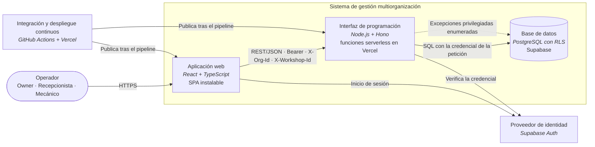

<div align="center">

**UNIVERSIDAD CATÓLICA BOLIVIANA "SAN PABLO"**

**DIRECCIÓN DE POSTGRADO**

**MAESTRÍA EN FULL STACK DEVELOPMENT**

---

## ANTEPROYECTO

### Diseño y validación de una arquitectura multi-tenant jerárquica con RLS para aislamiento verificable e inmutable en mantenimiento mecánico

---

**Postulante:** Daniel Mauricio Tarqui Apaza

**Tutor / Asesor:** Juan Perez

**Unidad Académica:** La Paz

**Modalidad de graduación:** Proyecto de Grado

La Paz – Bolivia
2026

</div>

---

## Resumen

El software de gestión de talleres disponible en Bolivia asume un taller por cuenta y resuelve la separación entre clientes en la capa de aplicación, de modo que un error de programación puede exponer los datos de una organización a otra. Este anteproyecto propone **diseñar, desarrollar y validar una arquitectura multi-tenant jerárquica** —una cuenta administra varias organizaciones y cada organización varios talleres— cuyo aislamiento se impone en el **motor de base de datos con Row Level Security (RLS)** y se refuerza con verificación de membresía en la capa de aplicación, sobre infraestructura serverless. La investigación es **aplicada**, de enfoque **cuantitativo** y diseño **cuasiexperimental**, y adopta *Design Science Research*: el artefacto se contrasta con una **línea base** en la que el aislamiento se resuelve solo en la aplicación. La variable dependiente es el número de **filas ajenas devueltas** en las siete tablas de negocio, medido bajo cuatro condiciones experimentales —entre ellas la omisión deliberada de los controles de la aplicación—, y la hipótesis predice su reducción a cero. Dos objetivos complementarios, la usabilidad del cambio de contexto y el costo operativo por organización, se evalúan con un criterio de continuidad que permite descartarlos sin afectar la hipótesis central. La Parte I desarrolla la fundamentación de la investigación; la Parte II, la propuesta técnica.

**Palabras clave:** multi-tenancy jerárquica; Row Level Security; aislamiento de datos; software como servicio; PostgreSQL; arquitectura serverless.

---

## Índice

**Parte I — Investigación**

1. Título del proyecto · 2. Planteamiento del problema · 3. Preguntas de investigación · 4. Justificación · 5. Antecedentes · 6. Estado del arte · 7. Marco teórico y conceptual · 8. Objetivo general · 9. Objetivos específicos · 10. Hipótesis · 11. Variables · 12. Operacionalización · 13. Matriz de consistencia · 14. Enfoque y tipo · 15. Diseño de investigación · 16. Población y muestra · 17. Técnicas e instrumentos · 18. Estrategia de análisis · 19. Consideraciones éticas

**Parte II — Propuesta técnica**

20. Antecedentes tecnológicos relevantes · 21. Propuesta de solución tecnológica · 22. Arquitectura preliminar del sistema · 23. Tecnologías y herramientas · 24. Diseño técnico preliminar · 25. Estrategia de implementación · 26. Cronograma de trabajo · 27. Resultados esperados · 28. Viabilidad técnica · 29. Referencias

**Anexo A** — Revisión de consistencia

---

# Parte I — Investigación

## 1. Título del proyecto

> **Diseño y validación de una arquitectura multi-tenant jerárquica con RLS para aislamiento verificable e inmutable en mantenimiento mecánico**

| Campo | Detalle |
|---|---|
| **Línea de investigación** | Arquitectura de software y seguridad de datos en aplicaciones de software como servicio |
| **Área de conocimiento** | Ingeniería de software · Bases de datos · Computación en la nube |
| **Período de ejecución** | Septiembre a diciembre de 2026 |
| **Ámbito de aplicación** | Servicio de mantenimiento mecánico; validación sobre organizaciones de servicio de motocicletas en Bolivia |

El título tiene 18 palabras e indica la **tecnología** (arquitectura multi-tenant jerárquica con RLS), el **objeto de estudio** (aislamiento verificable e inmutable) y el **dominio de impacto** (mantenimiento mecánico).

---

## 2. Planteamiento del problema

### 2.1 Árbol de problemas



**Efectos.** El historial del cliente queda fragmentado entre talleres de una misma organización —la gestión de varias organizaciones desde una cuenta está ausente en las 10 plataformas relevadas (§16.2)—; un solo error de consulta expone datos de una organización a otra, riesgo que la evidencia de fallos recurrentes en la aplicación de políticas de seguridad de fila vuelve concreto (§6.4); el operador que crece lleva cada local como una cuenta independiente o recurre a hojas de cálculo; y el costo de entrada excluye a buena parte de un sector con 84,2 % de informalidad laboral (§5.1).

**Problema central.** Los operadores que gestionan **varias organizaciones y talleres de servicio de mantenimiento mecánico** no disponen de un sistema que centralice su información sin exponerla a otras organizaciones: el software disponible es de un solo inquilino y, cuando separa datos entre clientes del sistema, lo hace **únicamente en el código de la aplicación**.

**Causas raíz.**

| # | Decisión de ingeniería | Consecuencia |
|---|---|---|
| 1 | **Arquitectura de un solo inquilino**: el software relevado con presencia en Bolivia (AutoSoft Taller, ServitechApp, TuneraTaller) y el regional (Appli-Car, Garage App) asume un taller por cuenta | No modela la pertenencia de varias organizaciones a una cuenta ni la de varios talleres a una organización |
| 2 | **Aislamiento solo en la capa de aplicación** | Basta que una consulta omita el filtro para que se produzca una fuga: no hay control por debajo que lo impida |
| 3 | **Sin modelo jerárquico** que distinga qué entidades pertenecen a la organización y cuáles al taller | Centralizar obliga a fragmentar al cliente o a mezclar inventarios de locales distintos |
| 4 | **Infraestructura con costo fijo por instalación** | El costo de entrada no se adapta a unidades de negocio pequeñas |

### 2.2 Delimitación del problema

| # | Dimensión | Delimitación |
|---|---|---|
| 1 | **Temática / tecnológica** | La capa de identidad, jerarquía organizacional y aislamiento de datos de un sistema web multiorganización: TypeScript en servidor (Node.js, Hono, Zod) y cliente (React), PostgreSQL con seguridad a nivel de fila sobre Supabase, y funciones serverless en Vercel |
| 2 | **Contextual** | Organizaciones de servicio y reparación de motocicletas en Bolivia cuyos operadores administran —o planean administrar— más de una organización y/o más de un taller |
| 3 | **Temporal** | Septiembre a diciembre de 2026; recolección de las métricas de validación en I8 (8 al 21 de diciembre de 2026) |
| 4 | **Límites y exclusiones** | No se construyen los módulos operativos fuera del corte vertical (motocicletas, órdenes de trabajo, historial de mantenimiento, panel de métricas); no se integran WhatsApp ni la factura electrónica del SIN; no hay aplicaciones nativas, migración de datos productivos, pruebas de carga o estrés, contenedores, pruebas de penetración ni evaluación de usabilidad de la interfaz completa. El detalle, en §21.6 |

### 2.3 Formulación del problema

> **¿De qué manera una arquitectura multi-tenant jerárquica con Row Level Security (RLS) sobre infraestructura serverless sostiene un aislamiento verificable e inmutable —cero filas ajenas devueltas aun cuando la capa de aplicación omite sus controles—, frente al aislamiento resuelto solo en la aplicación, en la gestión centralizada de varias organizaciones y talleres de servicio de mantenimiento mecánico en Bolivia?**

---

## 3. Preguntas de investigación

**Pregunta general.** La formulación del problema (§2.3) constituye la pregunta general. Se estructura como tecnología + efecto esperado + magnitud + condición + contexto, contrastada con la alternativa del mercado, y es directamente resoluble construyendo el sistema y midiendo sobre él.

**Preguntas específicas.** Una por cada objetivo específico, en el mismo orden:

1. ¿Qué estrategias de aislamiento multi-tenant documenta la literatura, con qué limitaciones, y qué carencias presentan las soluciones de gestión de talleres disponibles en Bolivia frente al modelo multiorganización? *(Diagnóstico)*
2. ¿Qué modelo de datos, qué políticas de seguridad a nivel de fila y qué contrato de interfaz permiten representar la jerarquía organización → talleres sosteniendo un único límite de aislamiento? *(Diseño)*
3. ¿Cómo se construye el corte vertical del sistema sobre infraestructura serverless de modo que conserve el diseño de aislamiento y quede verificado en cada integración? *(Desarrollo)*
4. ¿En qué medida la arquitectura propuesta reduce las filas ajenas devueltas frente a la línea base de aislamiento solo en la aplicación, y se sostiene esa reducción con la verificación de membresía deshabilitada? *(Validación)*
5. ¿Resulta el cambio de contexto entre organizaciones y talleres más eficiente y satisfactorio para el operador que el cambio de cuenta que exige el software de un solo inquilino? *(Complementaria)*
6. ¿Cuál es el costo operativo mensual por organización del despliegue serverless frente a un despliegue en servidor dedicado? *(Complementaria)*

---

## 4. Justificación

### 4.1 Técnica

El proyecto aporta una solución replicable a un problema conocido del software como servicio: sostener el aislamiento entre inquilinos en un esquema compartido sin que dependa de que cada consulta esté bien escrita. Lo resuelve situando el control en el motor de base de datos, reforzándolo con una verificación independiente en la aplicación, y extendiéndolo a un inquilino **jerárquico** —organización con varios talleres— cuyas entidades no comparten el mismo alcance. El patrón es aplicable a cualquier sistema multiorganización de esquema compartido, con independencia del rubro.

### 4.2 Económica / de negocio

El despliegue serverless, con escalado a cero y sin costo fijo por organización, reduce el costo de infraestructura a lo que se consume: la especificación del proyecto cabe en la capa gratuita de sus proveedores (§28.3), condición necesaria para ofrecer software especializado a un sector con 84,2 % de informalidad laboral. Administrar varias organizaciones y talleres desde una sola cuenta elimina, además, la duplicación de cuentas y registros que hoy impone el software de un solo inquilino. El objetivo complementario 6 cuantifica ese costo por organización.

### 4.3 De conocimiento

El proyecto documenta un procedimiento reproducible para **verificar** el aislamiento multi-tenant, no solo para afirmarlo: dos vías independientes de comprobación, una línea base contra la que se contrasta, un escenario de datos construido por la propia prueba y una matriz que traza cada requisito hasta su evidencia. La suite y su evidencia quedan disponibles como referencia reutilizable para evaluar otros sistemas de esquema compartido.

---

## 5. Antecedentes

### 5.1 Contexto del sector

**El parque de motocicletas y la demanda de servicio.** La motocicleta es el vehículo más numeroso de Bolivia. Según el Instituto Nacional de Estadística (INE), a partir de los registros del Registro Único para la Administración Tributaria Municipal (RUAT), en **2025** se contabilizaron **931.205 motocicletas**, el **34,8 %** del parque automotor nacional, encabezándolo por delante de vagonetas, automóviles y camionetas. Su crecimiento es sostenido y superior al del parque en conjunto: pasó de **657.718 unidades en 2021** a **872.550 en 2024** y a **931.205 en 2025**, un incremento del **41,6 % en cuatro años**, frente al +20,0 % del parque automotor total en el mismo período. Cada una de esas unidades requiere mantenimiento periódico y reparaciones, lo que sostiene una red amplia de talleres de servicio que crece año a año y empuja a los operadores más exitosos a abrir locales adicionales.

**Condiciones del sector que explican el problema.** Ese crecimiento ocurre en una economía marcadamente informal: el **empleo informal alcanzó el 86,8 % de la población ocupada en 2024** —6,0 de 6,9 millones de personas—, según el Cuadro 7 de UDAPE, elaborado con la Encuesta Continua de Empleo del INE. El indicador se emplea como caracterización cualitativa del sector y no interviene en ningún cálculo de este documento. Para el rubro de talleres esto se traduce en unidades de negocio pequeñas, con presupuesto de tecnología muy limitado y gestión apoyada todavía en registros en papel u hojas de cálculo.

| Fuente | Tipo |
|---|---|
| INE — **Cuadro N.º 1.2**, *Bolivia: parque automotor por tipo de servicio y clase de vehículo, 2003–2025* (datos originados en el RUAT). Cuadro del que proceden todas las cifras | Primaria (oficial, descargable) |
| INE — *Boletín estadístico parque automotor 2024* (28 de mayo de 2025) | Primaria (oficial) |
| INE — *Estadísticas del parque automotor 2003–2025* (1 de julio de 2026) | Primaria (oficial) |
| UDAPE — *Análisis de la población ocupada, desocupada e inactiva en Bolivia entre los años 2015 y 2024*, Cuadro 7, sobre la Encuesta Continua de Empleo del INE | Primaria (oficial, descargable) |

### 5.2 Revisión crítica de soluciones previas y arquitecturas legadas

| Etapa | Solución | Limitación frente al problema |
|---|---|---|
| **Software de escritorio por local** | Instalación local de un programa de gestión de taller, con su base de datos en el propio equipo | Cada local es una isla: no hay visión consolidada ni acceso remoto, y el costo de mantenimiento recae en cada instalación |
| **SaaS de un solo inquilino por cuenta** | La oferta relevada con presencia en Bolivia y en la región (§16.2) | Traslada el sistema a la nube pero conserva el supuesto de un taller por cuenta; el aislamiento entre cuentas, cuando existe, vive en el código |
| **Multi-tenancy con base o esquema por inquilino** | Una base de datos o un esquema separados por cliente del sistema (Krebs et al., 2012) | Aísla con fuerza, pero impone costo fijo y operación por inquilino, incompatibles con el presupuesto del sector |
| **Esquema compartido con discriminador en la aplicación** | Todas las organizaciones en las mismas tablas, filtradas por un identificador en cada consulta (Krebs et al., 2012) | Aprovecha recursos, pero dispersa la conciencia de inquilino por toda la base de código: un solo olvido produce una fuga (Bezemer & Zaidman, 2010) |
| **Esquema compartido con políticas en el motor** | Políticas de seguridad a nivel de fila evaluadas por el propio motor de base de datos (PostgreSQL Global Development Group, s. f.-b) | Traslada la condición de inquilino al motor, pero la literatura la estudia sobre inquilinos **planos** y documenta fallos del propio mecanismo (§6) |

---

## 6. Estado del arte

### 6.1 Protocolo de revisión

La revisión sigue las cuatro etapas de una revisión sistemática de literatura:

| Etapa | Aplicación |
|---|---|
| **Planificación** | Pregunta de revisión: ¿qué arquitecturas y mecanismos sostienen el aislamiento entre inquilinos en esquemas compartidos, y con qué limitaciones? Ventana de **2021 a 2026** |
| **Búsqueda** | Cadena booleana `("multi-tenant" OR "multi-tenancy" OR "multitenancy") AND ("row-level security" OR "tenant isolation" OR "data isolation") AND ("SaaS" OR "shared schema" OR "cloud")`, con términos del *ACM Computing Classification System* —*Security and privacy → Database and storage security*; *Software and its engineering → Software architectures*—, en ACM Digital Library, IEEE Xplore, Scopus, Google Scholar, BASE y OATD |
| **Selección** | Lectura progresiva título → resumen → conclusiones. Inclusión: revisión por pares o tesis de posgrado en ciencias de la computación; problema arquitectónico comparable aunque el rubro difiera. Exclusión: soluciones sobre tecnologías legadas y artículos de opinión sin validación métrica |
| **Síntesis** | Análisis **crítico**: de cada trabajo se consigna dónde falla frente al problema, y esa columna alimenta el enunciado del vacío (§6.5) |

### 6.2 Matriz del estado del arte

| Autor | Metodología | Aporte | Limitaciones |
|---|---|---|---|
| **Dar, Hershcovitch & Morrison (2023)** · *Proc. ACM Management of Data*, art. 89 · DOI 10.1145/3588943 | Experimental: ataques de canal lateral temporal sobre PostgreSQL y SQL Server, en instancias propias y gestionadas en AWS; diseño y medición de una defensa *data-oblivious* | La seguridad a nivel de fila impide devolver datos no autorizados, **pero el tiempo de ejecución de la consulta filtra información** sobre su existencia | Modelo de inquilinos **plano y de un solo nivel**, en la capa de consulta; no aborda dónde situar el límite de aislamiento cuando el inquilino tiene subdivisiones |
| **Alobaywi, Almutairi & Sheldon (2026)** · *IoT* (MDPI), 7(1), art. 21 · DOI 10.3390/iot7010021 | Revisión sistemática guiada por PRISMA de marcos de seguridad multi-inquilino IoT–nube | Clasifica las amenazas de intersección entre inquilinos: **fuga de datos, canal lateral y escalamiento de privilegios** | Al ser una revisión, **no propone ni valida una arquitectura**; su contexto son dispositivos IoT, no SaaS de gestión con estructura jerárquica |
| **Andriianenko (2026)** · Tesis de maestría, Universitatea Tehnică a Moldovei | Diseño y evaluación comparativa de **esquema compartido** frente a **base por inquilino** sobre un SaaS de gestión de proyectos con microservicios | El esquema compartido reduce recursos pero incrementa complejidad y riesgo de aislamiento; la base por inquilino separa mejor con mayor sobrecarga operativa | Evalúa ambos modelos como **alternativas planas y excluyentes**, sin la seguridad a nivel de fila como refuerzo dentro del esquema compartido ni una jerarquía de dos niveles |
| **Simić, Dedeić, Stojkov & Prokić (2024)** · *IEEE Access*, 12, pp. 32597–32617 · DOI 10.1109/ACCESS.2024.3369031 | Diseño e implementación de una jerarquía de espacios de nombres sobre nube distribuida en el borde, con evaluación del aislamiento y la redistribución de recursos | La jerarquía sostiene el aislamiento lógico entre inquilinos de distinto nivel | Su jerarquía organiza **recursos de infraestructura**, no filas de una base relacional compartida; no reparte entidades de negocio por nivel |
| **Olabanji, Fitch & Matthew (2023)** · *WSEAS Transactions on Computers*, 22, pp. 25–43 · DOI 10.37394/23205.2023.22.4 | Mapeo sistemático: 64 estudios revisados por pares seleccionados de 921 relevados (2015–2022) | Confirma que el aislamiento entre inquilinos en entornos *cloud-native* sigue siendo un problema abierto | Cataloga el conocimiento **sin proponer ni validar arquitectura**; su dominio son contenedores y orquestación |
| **Zhang, Yang, Du, Li, Chen & Sun (2021)** · *IEEE Access*, 9, pp. 15156–15169 · DOI 10.1109/ACCESS.2021.3051061 | Diseño de un control de flujo de información cifrado dirigido por el inquilino para máquinas virtuales, con prueba de seguridad y experimento | Impide la lectura ilegal de los datos privados del inquilino donde el control de acceso y el cifrado convencionales no controlan su propagación | Opera sobre **máquinas virtuales**, no sobre filas de una base relacional compartida |
| **Yassin, Ould-Slimane, Talhi & Boucheneb (2022)** · *IEEE Transactions on Services Computing*, 15(5), pp. 2925–2938 · DOI 10.1109/TSC.2021.3077852 | Diseño e integración de detección de intrusiones como servicio para SaaS multi-inquilino, probada en una nube pública real | Detección por inquilino en un SaaS de instancia compartida, con poca sobrecarga | Control **detectivo**: no impide el acceso cruzado ni propone aislamiento en la capa de datos |
| **Zhu, Shen, Dai, Xu & Hu (2024)** · *IEEE Transactions on Information Forensics and Security*, 19, pp. 4316–4330 · DOI 10.1109/TIFS.2024.3377549 | Diseño de un cifrado con búsqueda por palabra clave verificable y auditable, con análisis formal y experimentos | Búsqueda entre inquilinos que preserva la privacidad | **Da por supuesto el límite de aislamiento** de cada inquilino; no aborda cómo se impone en una base compartida |
| **Yin, Morvan, Martinez-Gil & Hameurlain (2025)** · *IEEE Transactions on Knowledge and Data Engineering*, 37(5), pp. 2743–2755 · DOI 10.1109/TKDE.2025.3543727 | Diseño de un banco de pruebas para bases de datos paralelas multi-inquilino que extiende TPC-DS | Evalúa el equilibrio entre beneficio del proveedor y satisfacción del inquilino | Mide rendimiento y precio, **no el aislamiento** |
| **Leburu (2026)** · *IEEE Access*, 14, pp. 97094–97117 · DOI 10.1109/ACCESS.2026.3706063 | Diseño de un plano de control determinista multi-inquilino para flujos con modelos de lenguaje, evaluado sobre 14 885 casos | El **aislamiento de inquilino** se sostiene en todas las evaluaciones como predicado determinista | Se impone y se verifica **en la capa de aplicación**, sin control en el motor de datos; inquilinos planos |

### 6.3 Síntesis comparativa

| Trabajo | Tipo de trabajo | Niveles de inquilino | Mecanismo de aislamiento | Capa donde se aplica | ¿Propone arquitectura? | ¿Valida empíricamente? |
|---|---|---|---|---|---|---|
| Zhang et al. (2021) | Diseño con prueba de seguridad | Uno (plano) | Flujo de información cifrado | Máquina virtual | Sí | Sí |
| Yassin et al. (2022) | Diseño e integración | Uno (plano) | Detección de intrusiones | Aplicación SaaS | Sí | Sí |
| Dar et al. (2023) | Experimental | Uno (plano) | RLS | Consulta | No | Sí |
| Olabanji et al. (2023) | Revisión de mapeo | Uno (plano) | Varios | Varias | No | No |
| Simić et al. (2024) | Experimental | Jerárquico (infraestructura) | Espacios de nombres | Infraestructura | Sí | Sí |
| Zhu et al. (2024) | Diseño criptográfico | Uno (plano) | Cifrado con búsqueda | Datos cifrados | Sí | Sí |
| Yin et al. (2025) | Banco de pruebas | Uno (plano) | — *(no mide aislamiento)* | Motor de base de datos | No | Sí |
| Alobaywi et al. (2026) | Revisión sistemática | Uno (plano) | Varios marcos | Varias | No | No |
| Andriianenko (2026) | Tesis con implementación | Uno (plano) | Esquema compartido / base por inquilino | Base de datos | Sí | Sí |
| Leburu (2026) | Diseño con evaluación empírica | Uno (plano) | Compuertas del plano de control | Aplicación | Sí | Sí |
| **Este proyecto** | **Design Science Research con validación cuasiexperimental** | **Dos (jerárquico, datos)** | **RLS + verificación en aplicación** | **Motor + aplicación** | **Sí** | **Sí, frente a una línea base** |

### 6.4 Evidencia técnica complementaria

No constituye literatura académica —son registros oficiales de vulnerabilidad— pero aporta evidencia verificable de que la aplicación de políticas de seguridad de fila ha fallado de forma **recurrente** en producción:

| Identificador | Año | Descripción |
|---|---|---|
| **CVE-2016-2193** | 2016 | Aplicación de política de seguridad de fila incorrecta ante reutilización de planes de consulta |
| **CVE-2023-2455** | 2023 | Nuevo caso del mismo tipo, no cubierto por la corrección anterior |
| **CVE-2024-10976** | 2024 | Seguimiento incompleto de tablas con seguridad de fila en PostgreSQL; aplicar una política incorrecta puede permitir lecturas y modificaciones prohibidas. CVSS 5.4, CWE-1250 |

### 6.5 Vacío de investigación

**Enunciado del vacío** — tecnología + condición + deficiencia:

> **Seguridad a nivel de fila** en esquemas compartidos cuyos **inquilinos son jerárquicos y sus entidades tienen alcance distinto por nivel**: falta una arquitectura que sitúe el único límite de aislamiento y **lo valide empíricamente frente a una línea base, con independencia de la capa de aplicación**.

**Dar et al. (2023)** demuestran que la seguridad a nivel de fila cumple su función como control de acceso; **sin embargo**, su análisis se limita a inquilinos planos y a la capa de consulta, sin abordar dónde ubicar el límite de aislamiento cuando el inquilino posee una subdivisión interna. **Alobaywi et al. (2026)** y **Olabanji et al. (2023)** sistematizan amenazas y tendencias, **pero** no proponen ni validan una arquitectura aplicable a un SaaS de gestión empresarial. **Andriianenko (2026)** compara esquema compartido frente a base por inquilino, **no obstante** los evalúa como alternativas planas y excluyentes. **Simić et al. (2024)** sí modelan una jerarquía, **aunque** su aislamiento opera sobre recursos de infraestructura y no sobre filas de una base relacional compartida. A ello se suma que la serie de CVE evidencia que confiar en una sola capa de aislamiento resulta insuficiente.

El resto de la revisión confirma el patrón desde otras capas: **Leburu (2026)** verifica empíricamente el aislamiento de inquilino, **pero** en la capa de aplicación; **Zhu et al. (2024)** dan por supuesto el límite de aislamiento que otras capas deben imponer; **Yassin et al. (2022)** detectan intrusiones sin impedir el acceso cruzado; **Zhang et al. (2021)** controlan la propagación de datos en máquinas virtuales, no en filas de una base compartida; y **Yin et al. (2025)** evalúan bases de datos multi-inquilino sin medir el aislamiento.

El presente proyecto aborda esta deficiencia mediante el **diseño, desarrollo y validación de una arquitectura multi-tenant jerárquica (organización → talleres)** que mantiene un **único límite de aislamiento verificable** a nivel de organización, tratando el taller como criterio de alcance operativo; refuerza la seguridad a nivel de fila con **verificación de membresía en la capa de aplicación**; y **contrasta la separación obtenida con una línea base** de aislamiento solo en la aplicación, por dos vías independientes.

---

## 7. Marco teórico y conceptual

El **marco conceptual** *nombra*: define la taxonomía técnica del proyecto. El **marco teórico** *fundamenta*: expone los modelos de ingeniería ya probados que rigen las decisiones del sistema. Este punto se presenta condensado; su desarrollo extenso, con la discusión completa de limitaciones, está en el [capítulo 3](03-marco-teorico-y-conceptual.md).

### 7.1 Marco conceptual — glosario técnico operacional

| # | Término | Definición formal | Fuente |
|---|---|---|---|
| 1 | **Node.js** | Entorno de ejecución de JavaScript en el servidor, sobre el motor V8, con entrada/salida no bloqueante y orientada a eventos. | OpenJS Foundation (s. f.) |
| 2 | **TypeScript** | Lenguaje que añade a JavaScript tipos estáticos opcionales, verificados en compilación y borrados en la salida ejecutable. | Microsoft (s. f.) |
| 3 | **API REST** | Estilo arquitectónico de seis restricciones —entre ellas **sin estado** e interfaz uniforme— sobre recursos identificados por URI. | Fielding (2000) |
| 4 | **JSON Web Token (JWT)** | Formato compacto que representa declaraciones como objeto JSON, verificable mediante firma digital. Estándar RFC 7519. | Jones et al. (2015) |
| 5 | **PostgreSQL** | Gestor objeto-relacional de código abierto, con cumplimiento ACID y soporte extensible de tipos, funciones y políticas de acceso. | PostgreSQL Global Development Group (s. f.-a) |
| 6 | **Row Level Security (RLS)** | Mecanismo que restringe **dentro del propio motor** qué filas ve o modifica cada usuario, mediante políticas evaluadas en toda consulta. | PostgreSQL Global Development Group (s. f.-b) |
| 7 | **Función serverless** | Cómputo sin administrar servidores, de ejecución **efímera y sin estado**, facturado por consumo y con escalado hasta cero. | Jonas et al. (2019) |
| 8 | **Validación por esquema** | Forma esperada de un dato declarada como esquema ejecutable, del cual se **deriva** el tipo estático. | Zod (s. f.) |
| 9 | **Progressive Web App (PWA)** | Aplicación web que, mediante manifiesto y *service worker*, resulta instalable sin pasar por una tienda de aplicaciones. | World Wide Web Consortium [W3C] (2026) |
| 10 | **Problem Details** | Formato normalizado de error para interfaces HTTP: tipo, título, estado y detalle. Estándar RFC 9457, que sustituye al 7807. | Nottingham et al. (2023) |
| 11 | **Modelo C4** | Notación de diagramas de arquitectura en cuatro niveles —contexto del sistema, contenedores, componentes y código—, de lo general a lo particular. | Brown (s. f.) |

### 7.2 Marco teórico — el «por qué»

#### 7.2.1 Arquitectura y multi-tenancy

**Base arquitectónica.** La restricción *stateless* de Fielding (2000) —cada petición contiene todo lo necesario para ser atendida— es lo que hace posible el despliegue serverless. Bass et al. (2021) fijan que la arquitectura se determina por sus **atributos de calidad** y no por su funcionalidad: aquí el atributo rector es el aislamiento entre organizaciones. Richards y Ford (2020) añaden que toda decisión arquitectónica es un intercambio cuyo valor documental está en registrar lo descartado.

**Multi-tenancy y su punto débil.** De las tres estrategias conocidas —base por inquilino, esquema por inquilino y **esquema compartido con discriminador**—, Krebs et al. (2012) sistematizan sus compromisos entre aprovechamiento de recursos y aislamiento, y Bezemer y Zaidman (2010) advierten que compartir instancia dispersa la conciencia de inquilino por toda la base de código. Se elige esquema compartido por el costo proporcional al uso que hace viable el escalado a cero (Jonas et al., 2019), y esa elección **obliga a un mecanismo por debajo de la aplicación**: la seguridad a nivel de fila lo aporta al mover la condición de inquilino desde la consulta hacia el motor.

**El vacío que el proyecto resuelve.** Esa taxonomía supone inquilinos **planos**, y aquí no lo son. Simić et al. (2024) son quienes más se aproximan a formalizar una jerarquía de inquilinos, pero la suya organiza recursos de infraestructura, no filas de una base relacional compartida. Queda planteado el problema teórico: **dónde situar el límite de aislamiento cuando el inquilino tiene subdivisiones**. Situarlo en el nivel superior y tratar la subdivisión como criterio de alcance conserva la centralización y la trazabilidad por local, a costa de que el alcance de cada entidad sea una **decisión de diseño explícita**.

#### 7.2.2 Persistencia, tipos e interfaz

**Datos y consistencia.** Codd (1970) hizo independiente la descripción lógica de los datos de su representación física, lo que permite expresar una regla de acceso como condición lógica sobre una relación —una política—. De las propiedades ACID de Haerder y Reuter (1983) se deriva una regla concreta: registrar un movimiento de existencias y actualizar la existencia del repuesto **deben ocurrir en una sola transacción**. Gilbert y Lynch (2002) probaron que ante particiones de red no caben consistencia y disponibilidad a la vez, y Kleppmann (2017) matiza que su modelo de fallo es estrecho; como el aislamiento exige **consistencia fuerte**, se adopta un motor relacional único y la escalabilidad se obtiene en la capa de cómputo.

**Tipos, interfaz y uso.** Pierce (2002) define el sistema de tipos como verificación formal ligera previa a la ejecución, y Gao et al. (2017) acotan su beneficio a cerca del **15 %** de los errores públicos en proyectos JavaScript. Krasner y Pope (1988) aportan la separación entre estado, presentación e interacción, hoy materializada en **componentes** con flujo unidireccional (Meta Open Source, s. f.); Nielsen (1993) fija los umbrales de percepción como criterio de diseño y **no** como objetivo medido, y la aplicación instalable se apoya en el manifiesto de aplicación web (W3C, 2026). Nielsen y Landauer (1993) muestran que la detección de problemas de uso sigue una **curva de rendimientos decrecientes**: cinco participantes bastan para detectar la mayoría de los problemas, pero no para estimar parámetros. Por eso la evaluación del objetivo 5 amplía la muestra a treinta participantes, que es lo que exige el contraste inferencial frente a la línea base (§18.2). La satisfacción se mide con la escala de Brooke (1996), según el baremo de Bangor et al. (2008), de donde procede el umbral de **68 puntos**; su consistencia interna se estima con el coeficiente alfa de Cronbach (1951).

#### 7.2.3 Modelos de seguridad

| Principio (Saltzer & Schroeder, 1975) | Enunciado | Materialización en el proyecto |
|---|---|---|
| **Mediación completa** | Todo acceso a todo objeto debe ser verificado | Las políticas se evalúan en el motor: ninguna consulta las elude |
| **Valores por defecto seguros** | La decisión predeterminada es denegar | Sin membresía activa no hay acceso; sin cabecera de contexto se rechaza |
| **Mínimo privilegio** | Permisos mínimos necesarios por sujeto | El rol se otorga por organización; lo administrativo, al propietario |
| **Economía del mecanismo** | La protección debe poder inspeccionarse | Un **único** criterio de aislamiento en todas las tablas |

**Roles y confianza cero.** Sandhu et al. (1996) asignan permisos a roles adquiridos por pertenencia, con el concepto de sesión; el proyecto aplica RBAC plano con una particularidad —**el rol no es un atributo global del usuario, sino de su relación con la organización**— y la sesión equivale al contexto activo declarado en cada petición. Rose et al. (2020) suprimen la confianza implícita basada en la ubicación de red: cada solicitud se autentica y autoriza individualmente.

**Defensa en profundidad e inmutabilidad del aislamiento.** Dar et al. (2023) demostraron que la seguridad a nivel de fila filtra información por el tiempo de ejecución de la consulta, y la serie de CVE evidencia fallos recurrentes del mecanismo (§6.4): confiar el aislamiento a una sola capa es insostenible. Situar la verificación en el motor —mediación completa— convierte además el aislamiento de **decisión de la aplicación** en **propiedad del dato**: ninguna ruta de código de la capa de aplicación puede apagarlo. Es una propiedad **comprobable** —se anula la verificación de membresía y se observa si las políticas siguen filtrando— y acotada: no afirma que el aislamiento sea inviolable ni que resista credenciales privilegiadas del motor.

#### 7.2.4 Metodología de investigación y de desarrollo

**Design Science Research.** Hevner et al. (2004) establecen que en la investigación en sistemas de información la contribución puede ser un **artefacto** —un constructo, modelo, método o instancia— siempre que se diseñe para resolver un problema relevante y se **evalúe con rigor**. Es el marco que legitima que el resultado de este proyecto sea un sistema y no solo un informe: el diseño responde al vacío de §6.5 y la evaluación es la validación cuasiexperimental del objetivo 4.

**Desarrollo iterativo y verificación continua.** Larman y Basili (2003) sitúan la ventaja del desarrollo iterativo en obtener retroalimentación verificable antes de comprometer la totalidad del esfuerzo; de Scrum (Schwaber & Sutherland, 2020) se conserva lo que aporta valor a un desarrollador único. Humble y Farley (2010) establecen que automatizar compilación, prueba y despliegue vuelve la entrega rutinaria y repetible, y Forsgren et al. (2018) lo validan empíricamente; Beck (2002) fija el orden de escritura —la prueba antes que el código—, que el proyecto aplica escribiendo las **pruebas de aislamiento antes** que la funcionalidad que protegen. La arquitectura se documenta con el modelo C4 (Brown, s. f.) en sus niveles de contenedores y componentes.

### 7.3 Revisión crítica de la literatura

| Teoría o modelo | Limitación documentada | Adaptación adoptada |
|---|---|---|
| **Serverless** (Jonas et al., 2019) | Arranque en frío y dependencia del proveedor | Se asume el arranque en frío —uso interno, sin exigencia de latencia estricta— y el aislamiento reside en el motor, no en el proveedor |
| **Row Level Security** (PostgreSQL GDG, s. f.-b) | Canal lateral temporal (Dar et al., 2023) y fallos recurrentes de aplicación | No es control único: se refuerza con verificación de membresía; el canal lateral queda fuera del alcance de mitigación |
| **Esquema compartido** (Krebs et al., 2012) | Dispersa la conciencia de inquilino (Bezemer & Zaidman, 2010) | Se elige igualmente por costo; la regla se concentra en el motor |
| **Microservicios** (Newman, 2021) | Complejidad operativa que el propio autor desaconseja sin una organización que la sostenga | Se descartan pese a que el comparable más cercano (Andriianenko, 2026) los emplea: se adopta un monolito modular desplegado como funciones |
| **Confianza cero** (Rose et al., 2020) | Supone una arquitectura empresarial completa | Se adopta el **principio**: verificación explícita en cada petición |
| **Tipado estático** (Pierce, 2002; Gao et al., 2017) | Beneficio medido en torno al **15 %** | Se combina con la suite de pruebas y con un umbral de cobertura |
| **Multi-tenancy jerárquica** (Simić et al., 2024) | Organiza recursos de infraestructura | Se traslada el principio a la capa de datos |
| **Muestras pequeñas** (Nielsen & Landauer, 1993) | Detectan problemas, no estiman parámetros | La evaluación del objetivo 5 usa treinta participantes para sostener el contraste inferencial; los cinco primeros siguen sirviendo para la lista de problemas |
| **Design Science Research** (Hevner et al., 2004) | Exige que la evaluación sea rigurosa, no una demostración | La evaluación se ancla en una línea base y en un criterio de decisión fijado de antemano (§10.3) |

### 7.4 Alineación metodológica

| Antecedente (§5) | Problema (§2) | Teoría (§7.2) | Objetivo · artefacto |
|---|---|---|---|
| Operadores que abren más de un local | Historial del cliente fragmentado | Multi-tenancy (Krebs et al., 2012) | O2 · jerarquía organización → talleres con alcance por nivel |
| Aislamiento resuelto solo en el código | Fuga ante un solo error de consulta | Mediación completa (Saltzer & Schroeder, 1975); RBAC (Sandhu et al., 1996) | O2 · políticas a nivel de fila más verificación de membresía |
| Fallos del mecanismo en producción | Insuficiencia de una única capa | Defensa en profundidad (Dar et al., 2023) | O4 · validación frente a la línea base, con la aplicación deshabilitada |
| Informalidad y bajo presupuesto | Barrera de costo | Serverless (Jonas et al., 2019) | O3 · despliegue en funciones · O6 · costo por organización |
| Ausencia de plataforma consolidada | Operar varias organizaciones desde una cuenta | Ausencia de estado (Fielding, 2000) | O3 · contexto activo declarado por petición |
| Cuentas separadas por local | Cambio de contexto costoso | Muestras y satisfacción (Nielsen & Landauer, 1993; Bangor et al., 2008) | O5 · evaluación frente al cambio de cuenta |
| — | Construir y verificar el artefacto | Design Science Research (Hevner et al., 2004); integración continua (Humble & Farley, 2010) | O3 · corte vertical con pipeline en verde |

---

## 8. Objetivo general

> **Diseñar, desarrollar y validar una arquitectura multi-tenant jerárquica con Row Level Security (RLS) sobre infraestructura serverless que sostenga un aislamiento verificable e inmutable —cero filas ajenas devueltas aun cuando la capa de aplicación omita sus controles—, para que los operadores de varias organizaciones y talleres de servicio de mantenimiento mecánico gestionen su información de forma centralizada.**

Sintetiza **qué** se construye, **para quién** y **con qué impacto**, y está ligado al título y al problema central (§2.1).

---

## 9. Objetivos específicos

### 9.1 Objetivos núcleo

Cuatro objetivos secuenciales —**Diagnosticar → Diseñar → Desarrollar → Validar**—, acotados a lo mínimo necesario para responder la pregunta general:

| # | Objetivo específico | Entregable verificable |
|---|---|---|
| 1 | **Diagnosticar** las estrategias de aislamiento multi-tenant documentadas en la literatura y las capacidades de las soluciones de gestión de talleres con presencia en Bolivia, para identificar el vacío que justifica el proyecto y fijar como línea base el aislamiento resuelto solo en la capa de aplicación | Matriz del estado del arte · análisis del mercado · enunciado del vacío · definición operativa de la línea base |
| 2 | **Diseñar** el modelo de datos de la jerarquía organización → talleres, las políticas de seguridad a nivel de fila y el contrato de la interfaz de programación que sostienen un único límite de aislamiento entre organizaciones | Especificación de requerimientos · modelo entidad-relación con alcance por nivel · políticas y funciones de verificación · diagramas C4 · contrato de la interfaz |
| 3 | **Desarrollar** el corte vertical del sistema —identidad, organizaciones, talleres, miembros, clientes e inventario— sobre el diseño del objetivo 2, con integración continua | Sistema en *staging* con el corte vertical operativo · pipeline en verde · cobertura ≥ 80 % en servicios de dominio |
| 4 | **Validar** el aislamiento mediante pruebas automatizadas por la interfaz de programación y por acceso directo a la base de datos, contrastando la arquitectura propuesta con la línea base y comprobando que la separación se sostiene con la verificación de membresía deshabilitada | Suite de aislamiento con matriz requisito → caso → evidencia · resultados de C0 a C3 en tres corridas reproducibles |

### 9.2 Objetivos complementarios — evaluables y descartables

| # | Objetivo específico | Criterio de continuidad | Fecha de decisión | Si se descarta |
|---|---|---|---|---|
| 5 | **Evaluar** con operadores del rubro la usabilidad del cambio de contexto entre organizaciones y talleres, frente al cambio de cuenta que exige el software de un solo inquilino | Al menos 30 operadores confirmados | 23 de noviembre de 2026 | Se reporta como hallazgo exploratorio, sin inferencia |
| 6 | **Evaluar** el costo operativo mensual por organización del despliegue serverless frente a un despliegue en servidor dedicado | Métricas de consumo suficientes para imputar costo por organización | 7 de diciembre de 2026 | El costo queda como análisis de viabilidad económica (§28.4) |

Su descarte no afecta la hipótesis (§10) ni el criterio de cierre del proyecto.

---

## 10. Hipótesis

Corresponde formular hipótesis porque la validación del objetivo 4 compara la arquitectura propuesta con una **línea base** mediante pruebas empíricas automatizadas. Se formula como hipótesis de trabajo **verificable y comparativa**. En el momento de presentar este anteproyecto la validación **no se ha ejecutado**.

### 10.1 Hipótesis de investigación (H1)

> **Si se implementa una arquitectura multi-tenant jerárquica con Row Level Security reforzada por verificación de membresía en la capa de aplicación en el sistema de gestión de talleres de mantenimiento mecánico, entonces las filas ajenas devueltas ante la omisión de los controles de la capa de aplicación se reducirán en un 100 % —a cero en las siete tablas de negocio— en comparación con el aislamiento resuelto solo en la capa de aplicación (línea base).**

### 10.2 Hipótesis nula (H0)

> La arquitectura propuesta no reduce a cero las filas ajenas devueltas frente a la línea base en al menos una de las siete tablas de negocio, o la reducción deja de sostenerse cuando se deshabilita la verificación de membresía de la capa de aplicación.

### 10.3 Criterio de decisión

La H0 se rechaza únicamente si **todas** las condiciones siguientes se cumplen en las **tres** corridas:

1. **La línea base discrimina**: bajo C0 (§15.2) la consulta con identidad ajena devuelve filas ajenas en las siete tablas de negocio. Si la línea base no fuga, el experimento no distingue entre arquitecturas y se declara **no concluyente**, no confirmatorio.
2. Bajo C1, C2 y C3 se devuelven **cero filas ajenas** en las siete tablas.
3. Bajo C1, el **100 %** de las operaciones del contrato sobre datos ajenos responde con el error de autorización especificado.

Un solo caso en contrario sostiene la H0.

### 10.4 Contraste estadístico del objetivo 5

Si el objetivo 5 continúa, su comparación con la línea base se somete a contraste sin predecir una magnitud: *H0*: el tiempo medio de las tareas de cambio de contexto con el selector es igual al del cambio de cuenta; *H1*: es menor. La puntuación SUS media se contrasta contra el umbral de 68. El procedimiento está en §18.2. No forma parte de la hipótesis de la tesis.

---

## 11. Variables

| Tipo | Variable | Definición conceptual | Objetivo |
|---|---|---|---|
| **Independiente** | **Arquitectura de aislamiento** | Capas de aislamiento activas en el sistema: ninguna efectiva (línea base), ambas, solo el motor, o acceso directo al motor | 4 |
| **Dependiente** | **Aislamiento entre organizaciones** | Grado en que los datos de una organización resultan inaccesibles para cuentas sin membresía activa en ella, comprobable por vías independientes (**verificable**) y sostenido con independencia de la capa de aplicación (**inmutable**) | 4 |
| **Dependiente** | **Gestión centralizada** | Capacidad de administrar varias organizaciones y talleres desde una sola cuenta conservando la visión consolidada del cliente | 4 |
| **Independiente** | **Modelo de cambio de contexto** | Selector de organización y taller activos, frente al cambio de cuenta del software de un solo inquilino | 5 |
| **Dependiente** | **Usabilidad del cambio de contexto** | Eficacia, eficiencia y satisfacción con que un operador sin formación previa se sitúa en la organización y el taller correctos | 5 |
| **Independiente** | **Modelo de despliegue** | Funciones serverless con escalado a cero, frente a servidor dedicado de costo fijo | 6 |
| **Dependiente** | **Costo operativo** | Gasto mensual de infraestructura imputable a cada organización | 6 |
| **Interviniente** | **Calidad del código** | Mantenibilidad y corrección estática del artefacto; condiciona la confianza en el resultado sin ser su causa | 3 |
| **Interviniente** | **Arranque en frío** | Latencia de la primera invocación de una función serverless; no se manipula, se mantiene constante | — |

---

## 12. Operacionalización

| Variable | Tipo | Dimensión | Indicador | Instrumento / Escala | Obj. |
|---|---|---|---|---|---|
| Arquitectura de aislamiento | VI (cualitativa) | Capas activas | Condición experimental C0 · C1 · C2 · C3 | Banco de pruebas / nominal | 4 |
| Aislamiento entre organizaciones | VD (cuantitativa) | Aislamiento en el motor | Filas ajenas devueltas por consulta directa (filas; esperado 0) · tablas de negocio con políticas activas (%; esperado 100) | Cliente PostgreSQL con identidad ajena (Vitest) / razón | 4 |
| | | Aislamiento en la aplicación | Operaciones con respuesta de autorización correcta (%; esperado 100) · respuestas indistinguibles entre recurso ajeno e inexistente (%; esperado 100) | Cliente HTTP de contrato (Vitest) / razón | 4 |
| | | Inmutabilidad | Casos en verde con la verificación de membresía deshabilitada (%; esperado 100) | Banco de pruebas con la verificación sustituida (Vitest) / razón | 4 |
| Gestión centralizada | VD (cuantitativa) | Alcance por nivel | Entidades de nivel organización accesibles desde cualquier taller (%; esperado 100) · entidades de nivel taller visibles fuera de su taller (cantidad; esperado 0) | Pruebas de integración (Vitest) / razón | 4 |
| | | Cambio de contexto | Operaciones que exigen reautenticación al cambiar de contexto (cantidad; esperado 0) | Pruebas de integración y de contrato desde el cliente (Vitest) / razón | 4 |
| Modelo de cambio de contexto | VI (cualitativa) | Condición de tarea | Selector de contexto · cambio de cuenta | Guion de tareas / nominal | 5 |
| Usabilidad del cambio de contexto | VD (cuantitativa) | Eficacia | Tasa de éxito por tarea (%; umbral ≥ 80) | Observación estructurada / razón | 5 |
| | | Eficiencia | Tiempo por tarea (s) · errores por tarea (cantidad) | Cronometraje y registro de incidencias / razón | 5 |
| | | Satisfacción | Puntuación SUS (0–100; umbral ≥ 68) · α de Cronbach (umbral > 0,8) | Cuestionario SUS / intervalo | 5 |
| Modelo de despliegue | VI (cualitativa) | Modelo | Serverless · servidor dedicado de referencia | Tarifas publicadas / nominal | 6 |
| Costo operativo | VD (cuantitativa) | Costo por organización | USD por organización al mes | Paneles de consumo de los proveedores y tarifas publicadas / razón | 6 |
| Calidad del código | Interviniente | Mantenibilidad | Cobertura de pruebas en servicios de dominio (%; umbral ≥ 80) · errores de verificación de tipos (cantidad; esperado 0) · vulnerabilidades críticas o altas en dependencias (cantidad; esperado 0) | Vitest con cobertura · verificador de tipos · auditoría de dependencias / razón | 3 |

---

## 13. Matriz de consistencia

Fila general y una fila por objetivo específico; cada fila se lee horizontalmente.

| Problema | Objetivo | Hipótesis | Variables | Metodología / Métrica |
|---|---|---|---|---|
| **General:** ¿De qué manera una arquitectura multi-tenant jerárquica con Row Level Security (RLS) sobre infraestructura serverless sostiene un aislamiento verificable e inmutable —cero filas ajenas devueltas aun cuando la capa de aplicación omite sus controles—, frente al aislamiento resuelto solo en la aplicación, en la gestión centralizada de varias organizaciones y talleres de servicio de mantenimiento mecánico en Bolivia? | Diseñar, desarrollar y validar una arquitectura multi-tenant jerárquica con Row Level Security (RLS) sobre infraestructura serverless que sostenga un aislamiento verificable e inmutable —cero filas ajenas devueltas aun cuando la capa de aplicación omita sus controles—, para que los operadores de varias organizaciones y talleres de servicio de mantenimiento mecánico gestionen su información de forma centralizada. | H1: la arquitectura propuesta reduce en un 100 % las filas ajenas devueltas —a cero en las siete tablas— frente al aislamiento solo en la aplicación | VI: arquitectura de aislamiento · VD: aislamiento entre organizaciones, gestión centralizada | Design Science Research, cuantitativo-aplicado, cuasiexperimental con línea base / filas ajenas devueltas (filas) |
| **Esp. 1:** ¿Qué estrategias de aislamiento documenta la literatura y qué carencias presenta la oferta boliviana? | Diagnosticar las estrategias de aislamiento y la oferta boliviana, fijando la línea base | — | — | Revisión sistemática y análisis documental / 10 fuentes con limitación consignada · capacidades ausentes en 10 plataformas |
| **Esp. 2:** ¿Qué modelo, qué políticas y qué contrato sostienen un único límite de aislamiento? | Diseñar el modelo jerárquico, las políticas y el contrato | — | VI: arquitectura de aislamiento (especificada) | Modelado de datos y C4 / niveles modelados (2) · límites de aislamiento (1) · tablas con criterio único de política (7 de 7) |
| **Esp. 3:** ¿Cómo se construye el corte vertical conservando el diseño y verificado en cada integración? | Desarrollar el corte vertical con integración continua | — | Interviniente: calidad del código | Desarrollo iterativo con integración continua / cobertura ≥ 80 % · 0 errores de tipos · 0 vulnerabilidades críticas · pipeline en verde |
| **Esp. 4:** ¿En qué medida la arquitectura reduce las filas ajenas frente a la línea base, y se sostiene sin la verificación de membresía? | Validar el aislamiento frente a la línea base, con la verificación deshabilitada | H1 · criterio de decisión §10.3 | VI: C0 · C1 · C2 · C3 · VD: aislamiento, gestión centralizada | Cuasiexperimental, censo de 7 tablas y todas las operaciones, 3 corridas / filas ajenas (0) · autorización correcta (100 %) · casos en verde sin la aplicación (100 %) |
| **Esp. 5** *(complementaria)*: ¿Es el cambio de contexto más eficiente y satisfactorio que el cambio de cuenta? | Evaluar la usabilidad del cambio de contexto frente al cambio de cuenta | Contraste §10.4 | VI: modelo de cambio de contexto · VD: usabilidad | Intrasujeto contrabalanceado, n = 30 / éxito ≥ 80 % · SUS ≥ 68 con α > 0,8 · t de Student pareada, p < 0,05 |
| **Esp. 6** *(complementaria)*: ¿Cuál es el costo mensual por organización del despliegue serverless frente a un servidor dedicado? | Evaluar el costo operativo por organización | — | VI: modelo de despliegue · VD: costo operativo | Telemetría de consumo durante I8 / USD por organización al mes |

---

## 14. Enfoque y tipo de investigación

Las categorías siguen la clasificación de Hernández-Sampieri y Mendoza (2018).

| Dimensión | Definición adoptada | Fundamento |
|---|---|---|
| **Tipo de investigación** | **Aplicada / tecnológica** | Resuelve un problema concreto mediante un artefacto de software evaluado |
| **Enfoque** | **Cuantitativo-aplicado**, conducido como **Design Science Research** (Hevner et al., 2004) | El resultado es un artefacto construido y evaluado con métricas objetivas: filas ajenas, porcentajes de casos, tiempos, puntuaciones y costo. La revisión de literatura y el análisis de mercado son insumo del diseño, no un enfoque paralelo |
| **Alcance** | **Descriptivo → propositivo → explicativo** | Descriptivo en el diagnóstico, propositivo en el diseño y el desarrollo, y explicativo en la validación, donde se contrasta la arquitectura con la línea base |
| **Método** | **Hipotético-deductivo** | La hipótesis se fija antes de la validación y se somete a pruebas capaces de refutarla |

---

## 15. Diseño de investigación

### 15.1 Tipo de diseño

**Cuasiexperimental con línea base, sobre caso único.** Se compara el **antes** —la línea base de aislamiento solo en la aplicación, C0— con el **después** —la arquitectura propuesta bajo tres condiciones, C1 a C3— sobre el mismo artefacto y el mismo escenario. Es cuasiexperimental porque no hay asignación aleatoria: las condiciones se manipulan deliberadamente, una a la vez.

### 15.2 Condiciones experimentales

| Condición | Descripción | Qué se observa |
|---|---|---|
| **C0 · Línea base** | Políticas de seguridad a nivel de fila deshabilitadas y verificación de membresía de la aplicación omitida, **solo en el proyecto de validación desechable**. Reproduce el aislamiento resuelto solo en la aplicación cuando su control falla | Filas ajenas devueltas; se espera que haya |
| **C1 · Arquitectura completa** | Ambas capas activas: políticas en el motor y verificación de membresía en la aplicación | Comportamiento nominal |
| **C2 · Sin verificación de aplicación** | Verificación de membresía sustituida por una versión que concede sin comprobar; solo actúan las políticas del motor | Si el aislamiento se sostiene por sí solo en la base de datos: **inmutabilidad** |
| **C3 · Acceso directo al motor** | Consulta con la identidad de otra cuenta, sin pasar por la interfaz de programación | Si las políticas filtran sin intervención de la aplicación |

### 15.3 Diseño de la evaluación de usabilidad *(objetivo 5)*

| Elemento | Definición |
|---|---|
| **Diseño** | Intrasujeto: cada participante realiza las tareas en las dos condiciones, **contrabalanceadas** —la mitad empieza por el selector y la otra mitad por el cambio de cuenta— para neutralizar el aprendizaje |
| **Condición de línea base** | **Cambio de cuenta**: cada local se opera con una cuenta propia, como en el software de un solo inquilino; cambiar de local exige cerrar sesión e iniciarla con la cuenta de ese local |
| **Condición propuesta** | **Selector de contexto**: una sola cuenta con selectores de organización y taller activos |
| **Tareas** | T1 cambiar de organización y confirmar los datos mostrados · T2 situarse en un taller y registrar un repuesto · T3 localizar un cliente registrado en otro taller de la misma organización |
| **Métricas** | Éxito por tarea, tiempo, errores y puntuación SUS por condición |

### 15.4 Escenario de laboratorio

```
Cuenta A ──owner──> Organización 1 ──> Taller 1.1 (repuestos propios)
                        │         └── Taller 1.2 (repuestos propios)
                        └── clientes de la Organización 1

Cuenta A ──owner──> Organización 2          (misma cuenta, otra organización)

Cuenta B ──owner──> Organización 3 ──> Taller 3.1 · clientes propios

Cuenta C  ── sin membresía en ninguna de las anteriores
```

Un solo montaje cubre las tres preguntas del aislamiento: **entre cuentas** (A frente a B), **entre organizaciones de la misma cuenta** (1 frente a 2) y **frente a quien no es miembro de ninguna** (C).

### 15.5 Secuencia del experimento

1. Reconstrucción del esquema desde las migraciones versionadas en el proyecto de validación desechable, y construcción del escenario por la propia prueba.
2. Ejecución bajo **C0** y registro de las filas ajenas devueltas.
3. Restauración de las políticas y ejecución bajo **C1**, **C2** y **C3**, una condición por vez.
4. Repetición del ciclo completo **tres veces**, en momentos distintos y sobre entornos reconstruidos (*test–retest*).
5. Contraste contra el criterio de decisión (§10.3) y conservación de la evidencia.

### 15.6 Validez y limitaciones del diseño

| Aspecto | Tratamiento |
|---|---|
| **Validez interna** | Entorno dedicado y reconstruido en cada ciclo; una sola condición manipulada por vez; resultado binario por caso, sin interpretación del investigador; contrabalanceo en el objetivo 5 |
| **Validez externa** | Limitada: entorno gestionado de capa gratuita, no producción a escala; tres inquilinos; operadores del servicio de motocicletas en Bolivia |
| **Limitación declarada** | No se prueba la fuga por canal lateral temporal (Dar et al., 2023): el aislamiento verificado es el de **contenido**, no el de metadatos inferibles por tiempo de ejecución |

---

## 16. Población y muestra

### 16.1 Población documental *(objetivo 1)*

| Elemento | Definición |
|---|---|
| **Población** | Publicaciones revisadas por pares sobre aislamiento entre inquilinos en esquemas compartidos, 2021–2026, indexadas en las bases de §6.1 |
| **Muestra** | **10 fuentes** seleccionadas |
| **Muestreo** | No probabilístico **por criterio**, con los criterios de inclusión y exclusión de §6.1 |

### 16.2 Población de soluciones del mercado *(objetivo 1)*

| Elemento | Definición |
|---|---|
| **Población** | Plataformas de gestión de talleres de servicio vehicular con presencia, uso o comercialización en Bolivia |
| **Muestra** | **10 plataformas**: 4 con presencia en Bolivia, 2 regionales de uso extendido y 4 referentes internacionales |
| **Muestreo** | No probabilístico **intencional**, por accesibilidad de la información pública del producto ([Análisis del mercado](../ingenieria/09-analisis-mercado.md)) |

### 16.3 Población técnica *(objetivos 2 y 4)*

| Elemento | Definición |
|---|---|
| **Población** | Las **tablas de negocio** del esquema y las **operaciones** expuestas por la interfaz de programación del sistema a construir |
| **Muestra** | **Censo — el 100 %**: 7 tablas de negocio (talleres, membresías, asignaciones, clientes, repuestos, movimientos de existencias y registro de auditoría) y la totalidad de las operaciones del contrato, bajo 4 condiciones y en 3 corridas |
| **Muestreo** | No probabilístico **intencional por caso crítico**: se ejerce el peor escenario de aislamiento. **No cabe muestreo probabilístico**: una sola tabla sin política activa es una fuga |
| **Sujetos de prueba** | 3 cuentas sintéticas, 3 organizaciones y 3 talleres generados por la propia prueba. **No intervienen personas** |

### 16.4 Población de operadores *(objetivo 5)*

| Elemento | Definición |
|---|---|
| **Población** | Operadores de organizaciones de servicio de motocicletas en Bolivia que administran —o planean administrar— más de una organización y/o más de un taller |
| **Muestra** | **30 participantes**, con sobre-reclutamiento de 36 para compensar abandonos |
| **Muestreo** | No probabilístico **intencional**, por perfil |
| **Justificación del tamaño** | Treinta participantes permiten aplicar el contraste de tiempos entre condiciones con la aproximación normal de la media de las diferencias; los primeros cinco bastan además para detectar la mayoría de los problemas de uso (Nielsen & Landauer, 1993) |
| **Criterio de exclusión** | Haber participado en el desarrollo o conocer la aplicación antes de la sesión |

### 16.5 Consumo de infraestructura *(objetivo 6)*

| Elemento | Definición |
|---|---|
| **Población** | El consumo de los entornos de *staging* y producción y del proyecto de validación durante la iteración I8 |
| **Muestra** | **Censo de los 14 días** de I8, con una lectura diaria de invocaciones, transferencia de datos y tamaño de base |
| **Muestreo** | No aplica: se mide la totalidad del período |

### 16.6 Sobre el alcance de las muestras

La muestra de operadores no representa al sector boliviano: permite el contraste intrasujeto entre condiciones, no la generalización. La caracterización del sector se apoya en las fuentes oficiales del INE (§5.1). La evaluación se acota al **cambio de contexto**; las demás pantallas no se someten a prueba con usuarios.

---

## 17. Técnicas e instrumentos

### 17.1 Matriz de instrumentos

| Fase | Técnica | Herramienta | Dato extraído | Frecuencia |
|---|---|---|---|---|
| **Aislamiento — vía base de datos** | Experimentación controlada | Vitest con cliente PostgreSQL autenticado con identidad ajena | Filas ajenas por tabla | 7 tablas × 4 condiciones × 3 corridas |
| **Aislamiento — vía interfaz** | Pruebas de contrato | Vitest con cliente HTTP | Estado y código `modulo.razon` por operación | Totalidad de las operaciones × C0, C1 y C2 × 3 corridas |
| **Independencia de capas** | Sustitución de la verificación de membresía | Vitest en el banco de pruebas | Casos en verde | C2 × 3 corridas |
| **Calidad del código** | Pruebas automatizadas y análisis estático | Vitest con cobertura · verificador de tipos · auditoría de dependencias | Cobertura %, errores de tipos, vulnerabilidades | En cada integración al ramal principal |
| **Interfaz** | Flujos extremo a extremo y auditoría de instalabilidad | Playwright | Éxito de T1–T3 · manifiesto y *service worker* válidos · ausencia de desbordamiento a 360 px y 1280 px | En cada integración, sin interfaz gráfica |
| **Usabilidad** *(obj. 5)* | Observación estructurada y encuesta estandarizada | Guion T1–T3 · cronómetro · planilla de incidencias · cuestionario SUS | Éxito, segundos, errores, puntuación SUS | 30 participantes × 3 tareas × 2 condiciones; SUS una vez por condición |
| **Costo** *(obj. 6)* | Telemetría del proveedor | Paneles de consumo de Supabase y Vercel · tarifas publicadas | Invocaciones, transferencia, tamaño de base → USD | Una lectura diaria durante los 14 días de I8 |

### 17.2 Recolección de los datos de aislamiento

| Fase | Qué se hace | Qué produce |
|---|---|---|
| **1 · Preparar el entorno** | Se crea un proyecto de base de datos **dedicado y desechable**, reconstruido desde cero con las migraciones versionadas y sin datos preexistentes | Esquema en estado conocido e identificador de la última migración |
| **2 · Construir el escenario** | La propia prueba crea las cuentas, organizaciones y talleres de §15.4, con correos irrepetibles sobre un dominio reservado | Escenario reproducible |
| **3 · Ejecutar** | Se corre la suite bajo C0, C1, C2 y C3, una condición por vez | Resultado binario por caso, código de respuesta y recuento de filas |
| **4 · Extraer la evidencia** | Se conservan la salida del ejecutor, el guion del escenario y la versión del esquema | Registro auditable |
| **5 · Repetir** | Tres ciclos completos en momentos distintos, sobre entornos reconstruidos | Confirmación de que el resultado no depende de una ejecución |

Un caso omitido por falta de credenciales del entorno se reporta como **omitido**, no como pasado.

### 17.3 Recolección de los datos de usabilidad y de costo

**Usabilidad.** Sesión individual —presencial o remota— sobre el entorno de producción con el escenario ya cargado. El cuestionario se aplica en la **versión en español validada** del SUS (Sevilla-González et al., 2020); el consentimiento, el guion de tareas, la planilla y el cuestionario están redactados en [Material de campo](../ingenieria/12-material-de-campo.md). Orden fijo: consentimiento informado; tareas T1–T3 en la primera condición asignada; SUS de esa condición; tareas en la segunda condición; SUS de la segunda; comentario abierto. Se registra por participante y condición: éxito o fallo por tarea, segundos, incidencias y las diez respuestas del cuestionario. Una intervención del observador se anota como **fallo**.

**Costo.** Cada día de I8 se registran, por entorno, las invocaciones de funciones, la transferencia de datos y el tamaño de la base, y se imputan a las organizaciones del escenario. El costo del servidor dedicado de referencia se toma de la tarifa publicada vigente en la fecha de medición.

### 17.4 Validez y confiabilidad de los instrumentos

| Principio | Cómo lo satisface este proyecto |
|---|---|
| **Validez** | El aislamiento se mide con el propio motor —contando filas— y con los códigos del contrato; **no se pregunta a nadie si percibe aislamiento**. La única variable medida con percepción es la usabilidad, con una escala validada (Brooke, 1996) |
| **Validez de contenido** | Censo completo: 7 tablas y todas las operaciones |
| **Validez de criterio** | Las dos vías se contrastan entre sí; una discrepancia es un hallazgo |
| **Validez de constructo** | Una sola condición manipulada por vez |
| **Confiabilidad** | Recolección automatizada de extremo a extremo, entorno reconstruido y tres corridas (*test–retest*). En el cuestionario SUS, consistencia interna con **α de Cronbach > 0,8** (Cronbach, 1951) |

**Identificadores irrepetibles.** Cada ejecución crea cuentas y organizaciones con identificadores nuevos en lugar de fijar una semilla constante. Lo que debe repetirse es el **resultado**, no los datos: una semilla constante sobre un entorno persistente haría que la segunda corrida encontrase las filas de la primera. Que el aislamiento se sostenga con identificadores distintos en cada corrida es evidencia adicional de que no depende de un caso particular.

---

## 18. Estrategia de análisis

### 18.1 Aislamiento *(objetivo 4)*

**Descriptivo y por criterio.** Recuento de filas ajenas por tabla y condición; porcentaje de tablas con políticas activas; porcentaje de operaciones con respuesta correcta; comparación C0 frente a C1–C3. La decisión se toma con el criterio de conjunción de §10.3.

**Por qué no se aplica estadística inferencial aquí.** Se evalúa el **100 % de la población** y cada caso es determinista: una prueba de significancia sobre un censo de resultados binarios sería un error de método. La estadística inferencial se aplica donde hay variabilidad muestral: la usabilidad.

### 18.2 Usabilidad *(objetivo 5)*

| Análisis | Indicador | Procedimiento |
|---|---|---|
| **Descriptivo** | Éxito, tiempo, errores, SUS | Porcentaje de éxito por tarea y condición; media, desviación estándar, mediana y percentil 90 de los tiempos; media de SUS por condición |
| **Consistencia interna** | Ítems del SUS | α de Cronbach por condición, con umbral > 0,8 |
| **Inferencial — tiempos** | Diferencia de tiempos entre condiciones | *t* de Student pareada, α = 0,05. Si la prueba de Shapiro-Wilk rechaza la normalidad de las diferencias, prueba de rangos con signo de Wilcoxon |
| **Inferencial — satisfacción** | SUS de la condición propuesta | *t* de Student de una muestra contra el umbral de 68, α = 0,05 |

### 18.3 Costo y calidad *(objetivos 6 y 3)*

Costo mensual estimado por organización en *staging* y producción, frente al costo fijo del servidor dedicado de referencia, con estadística descriptiva. Cobertura, errores de tipos y vulnerabilidades se comparan contra sus umbrales en cada integración.

### 18.4 Representación y herramientas

Tabla de filas ajenas por tabla y condición; gráfico C0 frente a C1–C3; barras de éxito por tarea y condición con la línea del umbral; diagrama de caja de tiempos por condición; distribución de SUS frente al baremo. El procesamiento se realiza con **hoja de cálculo** sobre la salida exportada de la suite y la planilla de sesiones, y los contrastes con **R** (funciones base `t.test`, `shapiro.test` y `wilcox.test`).

---

## 19. Consideraciones éticas

### 19.1 Privacidad por diseño

**No se emplea ningún dato productivo, real o personal en la validación técnica.** El escenario es **sintético y generado por la propia prueba**, con identificadores irrepetibles sobre un dominio de correo reservado, y se descarta con el entorno. La ausencia de información personal identificable es una **propiedad del diseño del experimento**, no una corrección posterior. El proyecto se conduce en coherencia con el derecho a la privacidad e intimidad que reconoce la Constitución Política del Estado (Estado Plurinacional de Bolivia, 2009, art. 21, num. 2).

### 19.2 Protección de los entornos

Las pruebas **no se ejecutan contra ningún entorno productivo ni contra infraestructura de terceros**. La condición C0 —políticas deshabilitadas— se aplica **únicamente** en el proyecto de validación dedicado y desechable, con datos sintéticos, y nunca en *staging* ni en producción. Las pruebas de carga, estrés y penetración están excluidas (§2.2), de modo que el procedimiento no puede degradar el servicio de nadie. La credencial privilegiada se lee **únicamente del entorno**, nunca del repositorio (RNF-103).

### 19.3 Participación de personas

La evaluación de usabilidad es el único componente con participantes humanos y se rige por cuatro compromisos: **consentimiento informado** firmado antes de la sesión, con derecho a retirarse sin dar motivo; **anonimización**, con resultados agregados y participantes identificados como P01…P30; **confidencialidad de sus organizaciones**; y la declaración explícita de que **se evalúa el sistema y no a la persona**. Ninguna sesión se graba en vídeo ni se registra dato alguno que permita identificar al participante.

### 19.4 Propiedad intelectual, licencias y dependencias

El sistema se construye sobre componentes de código abierto —Node.js, TypeScript, React, Hono, Zod, Vitest, Playwright y PostgreSQL, entre otros—, cuyos avisos de licencia se conservan íntegros; el trabajo propio se publica bajo licencia MIT. Los riesgos aplicables del **OWASP Top 10** se atienden con medidas declaradas y verificables: dos capas de aislamiento frente al *control de acceso roto*; consultas parametrizadas y validación de entrada con Zod frente a la *inyección*; identidad delegada, sin contraseñas propias almacenadas, frente a los *fallos de identificación y autenticación*; y auditoría de dependencias en cada integración frente a los *componentes vulnerables* (RNF-208). Las dependencias se auditan en cada integración y no se admiten vulnerabilidades críticas ni altas (RNF-208). La especificación atiende los riesgos del OWASP Top 10 aplicables a una interfaz multiorganización: control de acceso roto, inyección y fallos de identificación y autenticación. Los asistentes de inteligencia artificial pueden emplearse para código repetitivo y tareas mecánicas de redacción, pero **el planteamiento, el diseño arquitectónico y la interpretación de los resultados son de autoría del investigador**.

### 19.5 Integridad de los resultados

- Un caso **omitido** se reporta como omitido y **no cubre su requisito**.
- Si **una sola** tabla devolviera filas ajenas bajo C1, C2 o C3, se reporta la fuga con su tabla y su caso, y la H0 se sostiene.
- Si la línea base no fugara, el resultado se declara no concluyente en lugar de confirmatorio.
- Si un objetivo complementario se descarta, se declara con su criterio y su fecha; lo recolectado no se presenta como evidencia inferencial.
- La evidencia conservada permite que un tercero repita la ejecución y contraste los números.

---

# Parte II — Propuesta técnica

## 20. Antecedentes tecnológicos relevantes

La propuesta integra cuatro tecnologías consolidadas, cuya evolución se resume en §5.2:

| Tecnología | Por qué es relevante para la propuesta |
|---|---|
| **Seguridad a nivel de fila en PostgreSQL** | Traslada la condición de inquilino al motor y la evalúa en toda consulta, con independencia de la aplicación que la origine (PostgreSQL Global Development Group, s. f.-b) |
| **Proveedor de datos con identidad integrada** | Expone el identificador del usuario autenticado dentro del motor, condición para que las políticas puedan evaluarlo ([ADR-004](../ingenieria/07-decisiones-diseno.md)) |
| **Funciones serverless** | Eliminan el costo fijo por instalación y escalan a cero (Jonas et al., 2019) |
| **TypeScript de extremo a extremo** | Un solo sistema de tipos entre cliente y servidor, que comparte las formas de datos del contrato (Microsoft, s. f.) |

La oferta comercial que hoy atiende al sector —y su limitación de un solo inquilino— está relevada en el [Análisis del mercado](../ingenieria/09-analisis-mercado.md).

---

## 21. Propuesta de solución tecnológica

### 21.1 Problema e impacto

Se atiende el problema central de §2.1: la ausencia de un sistema que centralice varias organizaciones y talleres sin exponer sus datos. Su relevancia la sostienen el crecimiento del parque de motocicletas (§5.1), la ausencia de gestión multiorganización en las 10 plataformas relevadas y la evidencia de fallos del aislamiento en producción (§6.4).

### 21.2 Solución e innovación

Se propone un sistema web multiorganización cuyo aislamiento se aplica **dos veces y de forma independiente**: políticas de seguridad a nivel de fila en el motor y verificación de membresía en la aplicación, con el contexto activo —organización y taller— declarado en cada petición. **La innovación está en la integración, no en inventar un mecanismo**: una jerarquía de dos niveles con un único límite de aislamiento, un criterio de alcance explícito por entidad y un procedimiento que demuestra, frente a una línea base, que la separación no puede desactivarse desde la aplicación.

### 21.3 Pertinencia

La tecnología seleccionada es oportuna porque sus componentes están maduros y disponibles en capa gratuita (§28.3), y factible porque la desarrolla un solo desarrollador en un ecosistema único —TypeScript— sobre servicios gestionados que no exigen operación de servidores.

### 21.4 Análisis comparativo

| Criterio | SaaS de gestión de talleres relevados | ERP de código abierto de propósito general | **Propuesta** |
|---|---|---|---|
| **Estructura multiorganización** | Un taller por cuenta | Multiempresa genérica, sin alcance por nivel para el taller | Varias organizaciones por cuenta y varios talleres por organización, con alcance explícito por entidad |
| **Aislamiento entre organizaciones** | En el código, no documentado | Configurable en la aplicación | En el motor **y** en la aplicación, verificado frente a una línea base |
| **Costo de despliegue** | Suscripción por cuenta o local | Servidor y mantenimiento propios | Serverless con escalado a cero |
| **Especialización en el rubro** | Alta | Baja: requiere adaptación | Alta en el corte vertical |

### 21.5 Alcance funcional y técnico

**Alcance funcional (qué hace).** Registro con creación de la primera organización y taller; organizaciones y talleres adicionales; cambio de organización y selección de taller activos; gestión de miembros con roles y asignación a talleres; clientes (nivel organización) e inventario de repuestos con movimientos (nivel taller); registro de acciones críticas consultable por el propietario.

**Matriz de alcance técnico (cómo se construye).**

| Capa | Tecnologías | Entregable clave |
|---|---|---|
| **Frontend** | React · TypeScript · manifiesto de aplicación web | Interfaz responsiva e instalable, con selectores de contexto |
| **Backend y lógica** | Node.js · Hono · Zod · verificación de credenciales del proveedor | Interfaz REST conforme al contrato, con descripción OpenAPI |
| **Persistencia e identidad** | PostgreSQL con seguridad a nivel de fila · Supabase Auth · migraciones versionadas | Modelo entidad-relación con políticas activas en las 7 tablas de negocio |
| **DevOps y nube** | GitHub Actions · Vercel · Supabase (*staging*, producción y validación) | Pipeline con verificación de tipos, pruebas, cobertura y auditoría de dependencias; publicación automática tras aprobarlo |
| **Verificación** | Vitest · Playwright | Suite multinivel y evidencia de aislamiento reproducible |

### 21.6 Exclusiones

Los módulos operativos fuera del corte vertical (motocicletas, órdenes de trabajo, historial de mantenimiento y panel de métricas); la auditoría extendida a todas las entidades; WhatsApp Business API; la factura electrónica del SIN; aplicaciones nativas; migración de datos productivos; pruebas de carga, estrés o rendimiento a escala productiva —el dominio no las justifica—; contenedores e infraestructura como código; pruebas de penetración y mitigación del canal lateral temporal; y la evaluación de usabilidad de la interfaz completa.

### 21.7 Matriz investigación–solución

| Objetivo | Módulo de software que lo materializa |
|---|---|
| 1 · Diagnosticar | — (insumo de diseño: fija la línea base que reproduce la condición C0) |
| 2 · Diseñar | Esquema y políticas del motor · contrato de la interfaz · especificación de requerimientos |
| 3 · Desarrollar | Módulos de identidad, contexto activo, organizaciones, talleres, miembros, clientes, inventario y auditoría · cliente web · pipeline |
| 4 · Validar | Suite de aislamiento por las dos vías y banco de pruebas de las condiciones C0 a C3 |
| 5 · Evaluar usabilidad | Selectores de contexto del cliente web · escenario de línea base con una cuenta por local |
| 6 · Evaluar costo | Entornos de *staging* y producción desplegados · lectura de consumo |

---

## 22. Arquitectura preliminar del sistema

### 22.1 Estilo arquitectónico

| Criterio | Monolito modular | Microservicios | Serverless por función |
|---|---|---|---|
| **Complejidad operativa** | Baja | Alta | Media |
| **Escalabilidad** | Vertical o réplicas completas | Horizontal por servicio | Automática por demanda |
| **Costo inicial** | Bajo | Alto | Bajo, pago por uso |
| **Adecuado para** | MVP y alcance medio | Dominios amplios con varios equipos | Eventos e integración de APIs |

**Selección: monolito modular desplegado como funciones serverless.** Una sola aplicación organizada en módulos de dominio y en capas —controlador, servicio y repositorio—, desplegada como funciones con escalado a cero. Conserva la baja complejidad del monolito, recomendable para un desarrollador individual, y obtiene el costo por uso del modelo serverless ([ADR-009](../ingenieria/07-decisiones-diseno.md)).

### 22.2 Diagrama de contenedores (C4, nivel 2)



El diagrama de componentes (nivel 3) de la interfaz de programación está en [Arquitectura](../ingenieria/04-arquitectura.md).

### 22.3 Aislamiento en dos capas

1. **Motor de base de datos**: las políticas exigen membresía activa en la organización propietaria de la fila. Actúan aunque la aplicación falle u omita un filtro.
2. **Capa de aplicación**: cada operación verifica membresía y rol antes de actuar y responde con un error de negocio específico.

Los datos de negocio se consultan con la credencial de quien llama, para que la primera capa intervenga también en el camino de la interfaz; la verificación de la segunda capa consulta con privilegio, para no depender de la primera ([ADR-008](../ingenieria/07-decisiones-diseno.md)).

---

## 23. Tecnologías y herramientas

**Matriz de selección tecnológica.** Criterios: naturaleza de la carga y escalabilidad, costo total de propiedad, curva de aprendizaje y disponibilidad de talento, y seguridad y madurez del ecosistema.

| Necesidad técnica | Alternativas | Seleccionada | Justificación |
|---|---|---|---|
| Lenguaje y entorno del servidor | Python (FastAPI) · Java (Spring Boot) · Node.js | **Node.js con TypeScript** | La carga es de entrada/salida —peticiones que esperan red y base de datos—; tipado compartido con el cliente; soporte nativo en la plataforma serverless (ADR-001) |
| Marco de la interfaz | Express · NestJS · rutas de API de Next.js · Hono | **Hono** | Diseñado para TypeScript y funciones efímeras; desacopla la interfaz del cliente web (ADR-003) |
| Validación de entrada | Joi · Yup · Zod | **Zod** | Deriva el tipo estático del esquema, sin dos definiciones paralelas |
| Base de datos relacional | MySQL · SQL Server · PostgreSQL | **PostgreSQL** | Seguridad a nivel de fila nativa y de código abierto; MySQL no la ofrece y SQL Server añade costo de licencia (ADR-002) |
| Datos e identidad gestionados | Firebase · PostgreSQL autogestionado con identidad propia · Supabase | **Supabase** | Identidad integrada y evaluable en las políticas; Firebase es documental y no ofrece seguridad a nivel de fila (ADR-004) |
| Despliegue | Servidor dedicado · AWS Lambda · Vercel | **Vercel** | Plataforma gestionada con escalado a cero y publicación desde el repositorio; Lambda exige configurar pasarela y permisos |
| Cliente web | Angular · Vue.js · Next.js · React | **React (SPA)** | La aplicación es interna y autenticada: el renderizado en servidor no aporta; ecosistema amplio y TypeScript compartido |
| Pruebas unitarias y de integración | Jest · Mocha · Vitest | **Vitest** | Mismo ecosistema TypeScript y ESM, sin transpilación adicional |
| Pruebas extremo a extremo | Cypress · Selenium · Playwright | **Playwright** | Varios motores de navegador y anchos de pantalla en un solo ejecutor, sin interfaz gráfica en CI |
| Calidad de código | TSLint (obsoleto) · Biome · ESLint con Prettier | **ESLint + Prettier en *pre-commit*** | Estándar del ecosistema TypeScript; la calidad se automatiza antes de integrar |
| Integración y despliegue continuos | GitLab CI · Jenkins · GitHub Actions | **GitHub Actions** | Integrado con el repositorio, sin servidor propio que operar |

---

## 24. Diseño técnico preliminar

La especificación completa está en [Requisitos](../ingenieria/02-requisitos.md), [Modelo de datos](../ingenieria/05-modelo-datos.md), [Seguridad](../ingenieria/06-seguridad.md) y [Contrato de la interfaz](../ingenieria/10-contrato-api.md). Aquí se resume.

### 24.1 Actores

| Actor | Tipo | Objetivo en el sistema | Nivel de acceso |
|---|---|---|---|
| Propietario (`Owner`) | Humano | Administrar organizaciones, talleres, miembros y auditoría | Autenticado; privilegiado dentro de su organización |
| Recepcionista (`Receptionist`) | Humano | Registrar clientes y el catálogo de repuestos | Autenticado; permisos por rol |
| Mecánico (`Mechanic`) | Humano | Consultar clientes e inventario y registrar movimientos | Autenticado; permisos por rol |
| Cuenta sin membresía | Humano | — (actor del escenario de aislamiento) | Autenticado; sin acceso a la organización |
| Visitante | Humano | Registrarse | Sin credencial; solo el registro |
| Proveedor de identidad | Máquina | Emitir y renovar credenciales | Externo |
| Servidor con credencial privilegiada | Proceso interno | Ejecutar las excepciones enumeradas de ADR-008 | Interno, sin exposición pública |

### 24.2 Requerimientos, reglas y seguridad

| Bloque | Contenido |
|---|---|
| **Requerimientos funcionales** | 38 dentro del alcance —identidad, organizaciones, talleres, miembros, clientes, inventario, aislamiento y auditoría—, cada uno con actor, criterio de aceptación *Dado–Cuando–Entonces* y prioridad MoSCoW |
| **Reglas de negocio** | Un solo propietario activo por organización; correo de cliente único por organización; número de parte único por taller; existencias nunca negativas; movimientos inmutables; transferencia solo dentro de la organización y atómica; la asignación a talleres no altera permisos |
| **No funcionales** | Filas ajenas = 0 en las 7 tablas (RNF-101) · aislamiento sostenido sin la verificación de aplicación (RNF-102) · 0 errores de tipos (RNF-201) · cobertura ≥ 80 % (RNF-207) · 0 vulnerabilidades críticas o altas (RNF-208) · éxito ≥ 80 % y SUS ≥ 68 (RNF-404) · 0 incumplimientos graves de accesibilidad WCAG 2.1 AA (RNF-405) |
| **Seguridad** | Credencial de sesión del proveedor verificada en cada petición; rol por organización; TLS en tránsito y cifrado en reposo del proveedor; registro de acciones críticas conservado mientras exista la organización; solo el registro y la comprobación de disponibilidad son públicos; riesgos aplicables del **OWASP Top 10** cubiertos y trazados a su medida ([Arquitectura](../ingenieria/04-arquitectura.md) §10) |
| **Registros y observabilidad** | Registros operativos de la plataforma, de la base de datos y del pipeline, sin credenciales ni contenido de filas, separados del registro de auditoría de negocio ([Arquitectura](../ingenieria/04-arquitectura.md) §15) |

---

## 25. Estrategia de implementación

### 25.1 Metodología e iteraciones

Desarrollo iterativo con **iteraciones de dos semanas** que entregan **incrementos verticales** —de la interfaz a la base de datos—, con trazabilidad de cada historia a su requisito y objetivo. El orden busca descubrir los riesgos técnicos desde las primeras iteraciones: el esquema, las políticas y la autenticación van primero.

### 25.2 Priorización y MVP

**MoSCoW**: el MVP lo componen los requisitos funcionales `Must` más los no funcionales que bloquean la salida a producción —seguridad (RNF-101 a RNF-106 y RNF-208) y calidad (RNF-201 a RNF-203)—. **Corte vertical**: el módulo de clientes (nivel organización) se completa de punta a punta antes de expandir al inventario (nivel taller).

### 25.3 Estrategia multinivel de pruebas

| Nivel | Alcance y herramientas |
|---|---|
| **Unitarias** | Reglas de negocio puras: esquemas de validación, cálculo de existencias, resolución de permisos (Vitest) |
| **Contrato** | La interfaz antes de tocar la base: credencial, contexto obligatorio, forma del error (Vitest) |
| **Integración** | Flujos contra base de datos y proveedor de identidad reales (Vitest) |
| **Aislamiento** | Las dos vías y las condiciones C0 a C3 (Vitest) |
| **Componente del cliente** | Contrato desde el cliente: cabeceras de contexto y códigos de error (Vitest sobre DOM simulado) |
| **Extremo a extremo** | Flujos T1–T3 del cambio de contexto (Playwright) |
| **Auditorías** | Instalabilidad, diseño responsivo y **accesibilidad WCAG 2.1 AA** (Playwright) · dependencias (auditoría de npm) |

### 25.4 Criterios de aceptación

Cada historia de usuario y cada requisito funcional llevan criterios en formato **Dado–Cuando–Entonces**, que fijan su definición de terminado.

> *Dado* un recurso de otra organización, *cuando* una cuenta autenticada en la propia lo solicita por identificador, *entonces* recibe la misma respuesta que para un recurso inexistente.

### 25.5 KPIs de calidad

| KPI | Umbral |
|---|---|
| Cobertura de pruebas en servicios de dominio | ≥ 80 % |
| Requisitos `Must` con caso en verde | 100 % |
| Errores de verificación de tipos | 0 |
| Vulnerabilidades críticas o altas en dependencias | 0 |
| Integraciones al ramal principal con pipeline en verde | 100 % |
| Filas ajenas devueltas bajo C1, C2 y C3 | 0 |
| Incumplimientos graves o críticos de accesibilidad (WCAG 2.1 AA) | 0 |

> **Lo que estos KPI no miden.** No se miden deuda técnica ni duplicación de código: en un proyecto de un solo autor y cuatro meses, la calidad se gobierna con la cobertura, la verificación de tipos y la auditoría de dependencias, que bloquean la integración. Incorporar una plataforma de análisis estático añadiría una herramienta que ningún requisito exige ([Plan de pruebas](../ingenieria/11-plan-pruebas.md) §1.5).

### 25.6 Matriz preliminar de validación

| Módulo | Criterio de aceptación | Estrategia de prueba | Métrica / KPI | Estado |
|---|---|---|---|---|
| Identidad y registro | Dado un correo nuevo, cuando se registra, entonces existen cuenta, organización, taller y membresía `owner`, o ninguno | Integración | Atomicidad en el 100 % de los fallos simulados | Pendiente |
| Contexto activo | Dada una petición sin `X-Org-Id`, cuando exige contexto, entonces responde `400` | Contrato | 100 % de las rutas con contexto obligatorio | Pendiente |
| Organizaciones y miembros | Dado un `Mechanic`, cuando invita, entonces recibe `403` | Integración | 100 % de las reglas de rol | Pendiente |
| Clientes | Dado un cliente creado con el taller A activo, cuando se opera con el taller B, entonces se lista | Integración | 100 % de entidades de organización visibles entre talleres | Pendiente |
| Inventario | Dado un movimiento que dejaría existencia negativa, cuando se registra, entonces se rechaza sin alterar el stock | Unitaria e integración | Cobertura ≥ 80 % del servicio de inventario | Pendiente |
| Aislamiento | Dada la identidad de otra cuenta, cuando consulta directamente las 7 tablas bajo C1–C3, entonces obtiene cero filas ajenas | Aislamiento | 0 filas ajenas en 3 corridas | Pendiente |
| Cambio de contexto | Dado un operador con dos organizaciones, cuando cambia de organización, entonces el taller activo se limpia y los datos corresponden a la nueva | Extremo a extremo | T1–T3 en verde en cada integración | Pendiente |
| Pipeline | Dada una integración al ramal principal, cuando falla una prueba, entonces no se publica | CI | 100 % de integraciones verificadas | Pendiente |

---

## 26. Cronograma de trabajo

### 26.1 Descomposición del trabajo (EDT)

| Paquete | Entregables |
|---|---|
| **1 · Investigación y documentación** | Revisión sistemática · análisis del mercado · especificación · documento final |
| **2 · Persistencia** | Esquema de identidad y jerarquía · políticas y funciones de verificación · esquema de negocio · auditoría y permisos |
| **3 · Interfaz de programación** | Autenticación y contexto activo · organizaciones, talleres y miembros · clientes · inventario · auditoría · descripción OpenAPI |
| **4 · Cliente web** | Autenticación · selectores de contexto · módulos de clientes e inventario · instalabilidad y diseño responsivo |
| **5 · DevOps** | Pipeline de integración continua · entornos de *staging* y producción · proyecto de validación desechable |
| **6 · Validación** | Suite de aislamiento C0–C3 · pruebas extremo a extremo y auditorías · evaluación de usabilidad · medición de costo |

**Ruta crítica**: especificación y contrato → esquema y políticas → autenticación y contexto activo → organizaciones, talleres y miembros → clientes e inventario → cliente web → validación. El contrato de la interfaz se cierra **antes** de construir el cliente web. La estimación se hace en puntos de historia.

### 26.2 Fases e iteraciones

| Fase | Iteración | Fechas | Contenido |
|---|---|---|---|
| **F1 · Diagnóstico** *(obj. 1)* | I1 | 1–14 sep | Revisión sistemática, relevamiento del mercado, vacío y línea base |
| **F2 · Diseño** *(obj. 2)* | I2 | 15–28 sep | Requerimientos, modelo de datos, políticas, contrato, C4 y plan de pruebas |
| **F3 · Desarrollo** *(obj. 3)* | I3 | 29 sep – 12 oct | Esquema, políticas, **autenticación** y contexto activo |
| | I4 | 13–26 oct | Organizaciones, talleres y miembros con control de acceso por rol |
| | I5 | 27 oct – 9 nov | Clientes — nivel organización |
| | I6 | 10–23 nov | Inventario — nivel taller · reclutamiento de operadores |
| | I7 | 24 nov – 7 dic | Cliente web, pruebas extremo a extremo y publicación en *staging* y producción |
| **F4 · Validación y cierre** *(obj. 4, 5 y 6)* | I8 | 8–21 dic | Condiciones C0–C3 en tres corridas · sesiones con operadores · medición de costo · documento final |

*Reserva: del 22 al 31 de diciembre, para correcciones posteriores a la revisión del tutor.*

### 26.3 Hitos y puntos de decisión

| Hito | Fecha | Criterio de cumplimiento |
|---|---|---|
| **H1 · Diagnóstico y diseño aprobados** | 28 de septiembre | Perfil y anteproyecto revisados por el tutor; especificación cerrada |
| **H2 · Arquitectura base** | 12 de octubre | Esquema, políticas, autenticación y contexto activo operativos; primer caso de aislamiento en verde |
| **H3 · Corte vertical completo** | 23 de noviembre | Clientes e inventario funcionando y probados · **decisión sobre el objetivo 5** |
| **H4 · Sistema integrado** | 7 de diciembre | Cliente web en *staging* con T1–T3 en verde · **decisión sobre el objetivo 6** |
| **H5 · Validación concluida** | 21 de diciembre | C0–C3 en tres corridas con evidencia conservada; objetivos 5 y 6 ejecutados o descartados con su criterio; documento final entregado |

### 26.4 Diagrama de Gantt

| Actividad | S1 | S2 | O1 | O2 | N1 | N2 | D1 | D2 |
|---|:-:|:-:|:-:|:-:|:-:|:-:|:-:|:-:|
| Diagnóstico | ██ | | | | | | | |
| Diseño y especificación | | ██ | | | | | | |
| Esquema, políticas, autenticación y contexto | | | ██ | | | | | |
| Organizaciones, talleres y miembros | | | | ██ | | | | |
| Clientes | | | | | ██ | | | |
| Inventario · reclutamiento de operadores | | | | | | ██ | | |
| Cliente web y publicación | | | | | | | ██ | |
| Validación, evaluaciones y cierre | | | | | | | | ██ |

---

## 27. Resultados esperados

### 27.1 Resultados técnicos

| Resultado | Métrica asociada |
|---|---|
| Matriz del estado del arte y vacío formulado | 10 fuentes con limitación consignada |
| Especificación de requerimientos, modelo de datos, políticas, C4 y contrato | 7 de 7 tablas de negocio con criterio único de política |
| Sistema con el corte vertical desplegado en *staging* y producción | 100 % de requisitos `Must` con caso en verde · cobertura ≥ 80 % |
| Pipeline de integración y despliegue continuos | 100 % de integraciones verificadas · 0 vulnerabilidades críticas o altas |
| Evidencia reproducible de aislamiento | 0 filas ajenas bajo C1–C3 en 3 corridas |
| Informe de usabilidad *(si continúa el objetivo 5)* | Éxito por tarea · SUS con α de Cronbach · contraste de tiempos |
| Estimación de costo *(si continúa el objetivo 6)* | USD por organización al mes |

### 27.2 Impacto frente a la línea base

| Impacto | Línea base | Resultado esperado |
|---|---|---|
| Fuga ante la omisión del control de aplicación | Filas ajenas devueltas en las 7 tablas | Cero filas ajenas |
| Operación de varios locales | Una cuenta por local, con cierre e inicio de sesión | Una cuenta con cambio de contexto sin reautenticación |
| Costo de infraestructura | Costo fijo mensual de un servidor dedicado | Costo proporcional al uso, con escalado a cero |

---

## 28. Viabilidad técnica

### 28.1 Restricciones y supuestos

| Criterio | Restricción | Supuesto | Impacto |
|---|---|---|---|
| **Presupuesto** | Capa gratuita de Supabase y Vercel | El corte vertical cabe en 500 MB de base de datos y 1 millón de invocaciones mensuales | Determina que no haya gasto mensual |
| **Proyectos de base de datos** | El plan gratuito admite 2 proyectos activos y los pausa tras 1 semana de inactividad | *Staging* puede pausarse durante I8 para liberar el proyecto de validación | Si falla, se requiere el plan Pro |
| **Uso de la plataforma de despliegue** | El plan gratuito de Vercel es para uso personal no comercial | El proyecto académico y la evaluación con operadores no constituyen uso comercial | Si falla, se requiere el plan Pro |
| **Seguridad** | Credencial privilegiada solo en el servidor; TLS en tránsito | El proveedor cifra los datos en reposo, según su declaración de seguridad | Condición para exponer producción a operadores |
| **Tiempo** | 16 semanas y un solo desarrollador | Dedicación sostenida por iteración | Reserva de 10 días |
| **Competencias** | Ecosistema TypeScript | La curva de aprendizaje de Hono y Supabase es acotada | Ritmo de desarrollo |
| **Participantes** | 30 operadores del perfil | Se confirman durante I6 | Continuidad del objetivo 5 |

### 28.2 Riesgos y mitigación

| ID | Riesgo | Impacto | Prob. | Mitigación |
|---|---|---|---|---|
| **R1** | Las políticas de aislamiento resultan incorrectas o incompletas | Alto | Media | Pruebas de aislamiento escritas **antes** que la funcionalidad y ejecutadas tras cada cambio de esquema |
| **R2** | El alcance crece más allá de lo planificado | Medio | Alta | Exclusiones cerradas; alcance congelado en H3 |
| **R8** | No se consiguen 30 operadores o se retiran | Medio | Alta | Reclutar 36 durante I6; sesiones remotas; criterio de continuidad del objetivo 5 |
| **R3** | Cambios o límites de los proveedores externos | Medio | Media | Acceso al proveedor tras una capa propia; aislamiento en el motor, no en el proveedor |
| **R9** | Se exceden los límites de la capa gratuita | Medio | Media | Pausar *staging* en I8; contingencia de plan Pro |
| **R4** | Las políticas se complican con el segundo nivel | Medio | Media | Un solo criterio de aislamiento en todas las tablas |
| **R5** | Tiempo insuficiente | Medio | Media | Reserva de 10 días; objetivos complementarios descartables |
| **R7** | Pérdida de trabajo por fallo de equipo | Alto | Baja | Repositorio remoto e integración frecuente |
| **R6** | Fuentes académicas insuficientes | Bajo | Media | Ampliar a arquitecturas comparables; admitir tesis de posgrado |
| **R10** | Métricas de consumo insuficientes para imputar costo | Bajo | Media | Criterio de continuidad del objetivo 6 |

### 28.3 Recursos y presupuesto

Tarifas y límites consultados el **14 de septiembre de 2026** en las páginas de precios de Supabase, Vercel y GitHub; los valores de esta sección corresponden a esa fecha.

| Categoría | Recurso | Especificación | Propósito | Costo mensual |
|---|---|---|---|---|
| Base de datos e identidad | Supabase, plan gratuito — 2 proyectos (*staging* y producción) | 500 MB de base de datos, CPU compartida con 500 MB de RAM, 5 GB de transferencia, 50 000 usuarios activos mensuales, pausa tras 1 semana sin actividad | Pruebas integradas y evaluación con operadores | USD 0 |
| Proyecto de validación | Supabase, proyecto desechable | Mismas especificaciones; ocupa el lugar de *staging* durante I8 | Condiciones C0–C3 | USD 0 |
| Cómputo serverless | Vercel, plan gratuito | 1 millón de invocaciones y 100 GB de transferencia al mes; uso personal no comercial | *Staging* y producción | USD 0 |
| Integración continua | GitHub Actions, plan gratuito | Ejecutores estándar: sin costo en repositorio público; 2000 minutos al mes en repositorio privado | Pipeline en cada integración | USD 0 |
| Desarrollo | Equipo personal y herramientas de código abierto | — | Construcción | USD 0 |
| Fuentes académicas | Google Scholar, IEEE Xplore, ACM, Scopus, BASE, OATD | Acceso institucional | Revisión sistemática | USD 0 |

**Presupuesto mensual de *staging* y producción: USD 0** en capa gratuita. **Contingencia**: si se exceden los límites o se requieren tres proyectos simultáneos, Supabase Pro (desde USD 25 al mes) y, si la restricción de uso lo exigiera, Vercel Pro (USD 20 al mes): **USD 45 al mes** como techo previsto.

### 28.4 Análisis de viabilidad

| Dimensión | Evaluación |
|---|---|
| **Técnica** | Componentes maduros y compatibles: seguridad a nivel de fila nativa en PostgreSQL, identidad del proveedor evaluable en las políticas, adaptador de Hono para Vercel y TypeScript de extremo a extremo |
| **Operativa** | Servicios gestionados sin servidores que operar; publicación automática tras el pipeline; registros de ejecución del proveedor y del motor de datos para el diagnóstico, y paneles de consumo para el costo ([Arquitectura](../ingenieria/04-arquitectura.md) §15) |
| **Temporal** | Ocho iteraciones con incremento verificable, 10 días de reserva y dos objetivos complementarios descartables que liberan I8 si falta tiempo |
| **Económica** | USD 0 al mes en capa gratuita, con techo de contingencia de USD 45 al mes; sin licencias |

---

## 29. Referencias

Estilo **APA (7.ª edición)**. El estado de verificación entrada por entrada consta en el [Anexo de verificación de referencias](anexo-referencias.md). La documentación técnica sin autor humano se cita con autor corporativo y fecha de recuperación, y se emplea únicamente como sustento del marco conceptual. Las obras con DOI o identificador permanente no llevan fecha de recuperación en APA 7, de modo que su **fecha de consulta** se registra en el anexo: **14 de septiembre de 2026** para Zhang et al. (2021), Yassin et al. (2022), Zhu et al. (2024), Yin et al. (2025), Leburu (2026), Cronbach (1951) y Hevner et al. (2004); **18 de agosto de 2026** para las demás.

Alobaywi, B., Almutairi, M. G., & Sheldon, F. T. (2026). Performance trade-offs in multi-tenant IoT–cloud security: A systematic review of emerging technologies. *IoT, 7*(1), 21. https://doi.org/10.3390/iot7010021

Andriianenko, O. (2026). *Design and evaluation of multi-tenant architectures in microservice based project management systems* [Tesis de maestría, Universitatea Tehnică a Moldovei]. https://repository.utm.md/handle/5014/35481

Bangor, A., Kortum, P. T., & Miller, J. T. (2008). An empirical evaluation of the System Usability Scale. *International Journal of Human–Computer Interaction, 24*(6), 574–594. https://doi.org/10.1080/10447310802205776

Bass, L., Clements, P., & Kazman, R. (2021). *Software architecture in practice* (4.ª ed.). Addison-Wesley Professional.

Beck, K. (2002). *Test-driven development: By example*. Addison-Wesley Professional.

Bezemer, C.-P., & Zaidman, A. (2010). Multi-tenant SaaS applications: Maintenance dream or nightmare? En *Proceedings of the Joint ERCIM Workshop on Software Evolution and International Workshop on Principles of Software Evolution* (pp. 88–92). ACM. https://doi.org/10.1145/1862372.1862393

Brooke, J. (1996). SUS: A quick and dirty usability scale. En P. W. Jordan, B. Thomas, B. A. Weerdmeester, & I. L. McClelland (Eds.), *Usability evaluation in industry* (pp. 189–194). Taylor & Francis.

Brown, S. (s. f.). *The C4 model*. Recuperado el 14 de septiembre de 2026, de https://c4model.com/

Codd, E. F. (1970). A relational model of data for large shared data banks. *Communications of the ACM, 13*(6), 377–387. https://doi.org/10.1145/362384.362685

Cronbach, L. J. (1951). Coefficient alpha and the internal structure of tests. *Psychometrika, 16*(3), 297–334. https://doi.org/10.1007/BF02310555

Dar, C., Hershcovitch, M., & Morrison, A. (2023). RLS side channels: Investigating leakage of row-level security protected data through query execution time. *Proceedings of the ACM on Management of Data, 1*(1), Artículo 89, 1–25. https://doi.org/10.1145/3588943

Estado Plurinacional de Bolivia. (2009). *Constitución Política del Estado* (promulgada el 7 de febrero de 2009). Recuperado el 14 de septiembre de 2026, de https://www.planificacion.gob.bo/uploads/marco-legal/nueva_constitucion_politica_del_estado.pdf

Fielding, R. T. (2000). *Architectural styles and the design of network-based software architectures* [Tesis doctoral, University of California, Irvine].

Forsgren, N., Humble, J., & Kim, G. (2018). *Accelerate: The science of lean software and DevOps*. IT Revolution Press.

Gao, Z., Bird, C., & Barr, E. T. (2017). To type or not to type: Quantifying detectable bugs in JavaScript. En *2017 IEEE/ACM 39th International Conference on Software Engineering* (pp. 758–769). IEEE. https://doi.org/10.1109/ICSE.2017.75

Gilbert, S., & Lynch, N. (2002). Brewer's conjecture and the feasibility of consistent, available, partition-tolerant web services. *ACM SIGACT News, 33*(2), 51–59. https://doi.org/10.1145/564585.564601

Haerder, T., & Reuter, A. (1983). Principles of transaction-oriented database recovery. *ACM Computing Surveys, 15*(4), 287–317. https://doi.org/10.1145/289.291

Hernández-Sampieri, R., & Mendoza Torres, C. P. (2018). *Metodología de la investigación: Las rutas cuantitativa, cualitativa y mixta*. McGraw-Hill Education.

Hevner, A. R., March, S. T., Park, J., & Ram, S. (2004). Design science in information systems research. *MIS Quarterly, 28*(1), 75–106. https://doi.org/10.2307/25148625

Humble, J., & Farley, D. (2010). *Continuous delivery: Reliable software releases through build, test, and deployment automation*. Addison-Wesley Professional.

Instituto Nacional de Estadística de Bolivia. (2026). *Bolivia: parque automotor por tipo de servicio y clase de vehículo, 2003–2025* (Cuadro N.º 1.2) [Conjunto de datos]. Elaborado con registros del Registro Único para la Administración Tributaria Municipal. https://www.ine.gob.bo/index.php/estadisticas-economicas/transportes/parque-automotor-cuadros-estadisticos/

Jonas, E., Schleier-Smith, J., Sreekanti, V., Tsai, C.-C., Khandelwal, A., Pu, Q., Shankar, V., Carreira, J., Krauth, K., Yadwadkar, N., Gonzalez, J. E., Popa, R. A., Stoica, I., & Patterson, D. A. (2019). *Cloud programming simplified: A Berkeley view on serverless computing* (Informe técnico N.º UCB/EECS-2019-3). University of California, Berkeley. https://arxiv.org/abs/1902.03383

Jones, M., Bradley, J., & Sakimura, N. (2015). *JSON Web Token (JWT)* (RFC 7519). Internet Engineering Task Force. https://doi.org/10.17487/RFC7519

Kleppmann, M. (2017). *Designing data-intensive applications: The big ideas behind reliable, scalable, and maintainable systems*. O'Reilly Media.

Krasner, G. E., & Pope, S. T. (1988). A cookbook for using the model-view-controller user interface paradigm in Smalltalk-80. *Journal of Object-Oriented Programming, 1*(3), 26–49.

Krebs, R., Momm, C., & Kounev, S. (2012). Architectural concerns in multi-tenant SaaS applications. En *Proceedings of the 2nd International Conference on Cloud Computing and Services Science* (pp. 426–431). SciTePress. https://doi.org/10.5220/0003957604260431

Larman, C., & Basili, V. R. (2003). Iterative and incremental developments: A brief history. *Computer, 36*(6), 47–56. https://doi.org/10.1109/MC.2003.1204375

Leburu, N. (2026). Trust-aware orchestration architecture for LLM-assisted workflows in multi-tenant enterprise systems. *IEEE Access, 14*, 97094–97117. https://doi.org/10.1109/ACCESS.2026.3706063

Meta Open Source. (s. f.). *React documentation*. Recuperado el 14 de septiembre de 2026, de https://react.dev/

Microsoft. (s. f.). *TypeScript documentation*. Recuperado el 14 de septiembre de 2026, de https://www.typescriptlang.org/docs/

Newman, S. (2021). *Building microservices: Designing fine-grained systems* (2.ª ed.). O'Reilly Media.

Nielsen, J. (1993). *Usability engineering*. Morgan Kaufmann.

Nielsen, J., & Landauer, T. K. (1993). A mathematical model of the finding of usability problems. En *Proceedings of the INTERACT '93 and CHI '93 Conference on Human Factors in Computing Systems* (pp. 206–213). ACM. https://doi.org/10.1145/169059.169166

Nottingham, M., Wilde, E., & Dalal, S. (2023). *Problem details for HTTP APIs* (RFC 9457). Internet Engineering Task Force. https://doi.org/10.17487/RFC9457

Olabanji, D., Fitch, T., & Matthew, O. (2023). Multi-tenancy in cloud-native architecture: A systematic mapping study. *WSEAS Transactions on Computers, 22*, 25–43. https://doi.org/10.37394/23205.2023.22.4

OpenJS Foundation. (s. f.). *Node.js documentation*. Recuperado el 14 de septiembre de 2026, de https://nodejs.org/docs/latest/api/

Pierce, B. C. (2002). *Types and programming languages*. MIT Press.

PostgreSQL Global Development Group. (s. f.-a). *PostgreSQL documentation*. Recuperado el 14 de septiembre de 2026, de https://www.postgresql.org/docs/current/

PostgreSQL Global Development Group. (s. f.-b). *Row security policies*. Recuperado el 14 de septiembre de 2026, de https://www.postgresql.org/docs/current/ddl-rowsecurity.html

Richards, M., & Ford, N. (2020). *Fundamentals of software architecture: An engineering approach*. O'Reilly Media.

Rose, S., Borchert, O., Mitchell, S., & Connelly, S. (2020). *Zero trust architecture* (NIST Special Publication 800-207). National Institute of Standards and Technology. https://doi.org/10.6028/NIST.SP.800-207

Saltzer, J. H., & Schroeder, M. D. (1975). The protection of information in computer systems. *Proceedings of the IEEE, 63*(9), 1278–1308. https://doi.org/10.1109/PROC.1975.9939

Sandhu, R. S., Coyne, E. J., Feinstein, H. L., & Youman, C. E. (1996). Role-based access control models. *Computer, 29*(2), 38–47. https://doi.org/10.1109/2.485845

Sevilla-González, M. del R., Moreno Loaeza, L., Lazaro-Carrera, L. S., Bourguet Ramirez, B., Vázquez Rodríguez, A., Peralta-Pedrero, M. L., & Almeda-Valdes, P. (2020). Spanish version of the System Usability Scale for the assessment of electronic tools: Development and validation. *JMIR Human Factors, 7*(4), e21161. https://doi.org/10.2196/21161

Schwaber, K., & Sutherland, J. (2020). *The Scrum Guide: The definitive guide to Scrum*. Recuperado el 14 de septiembre de 2026, de https://scrumguides.org/

Simić, M., Dedeić, J., Stojkov, M., & Prokić, I. (2024). A hierarchical namespace approach for multi-tenancy in distributed clouds. *IEEE Access, 12*, 32597–32617. https://doi.org/10.1109/ACCESS.2024.3369031

Unidad de Análisis de Políticas Sociales y Económicas. (2025). *Análisis de la población ocupada, desocupada e inactiva en Bolivia entre los años 2015 y 2024*. UDAPE. https://www.udape.gob.bo/wp-content/uploads/2026/03/Analisis-de-la-condicion-actividad-2025.pdf

World Wide Web Consortium. (2026). *Web application manifest* (W3C Working Draft del 13 de agosto de 2026). https://www.w3.org/TR/appmanifest/

Yassin, M., Ould-Slimane, H., Talhi, C., & Boucheneb, H. (2022). Multi-tenant intrusion detection framework as a service for SaaS. *IEEE Transactions on Services Computing, 15*(5), 2925–2938. https://doi.org/10.1109/TSC.2021.3077852

Yin, S., Morvan, F., Martinez-Gil, J., & Hameurlain, A. (2025). MTD-DS: An SLA-aware decision support benchmark for multi-tenant parallel DBMSs. *IEEE Transactions on Knowledge and Data Engineering, 37*(5), 2743–2755. https://doi.org/10.1109/TKDE.2025.3543727

Zhang, Z., Yang, Z., Du, X., Li, W., Chen, X., & Sun, L. (2021). Tenant-led ciphertext information flow control for cloud virtual machines. *IEEE Access, 9*, 15156–15169. https://doi.org/10.1109/ACCESS.2021.3051061

Zhu, X., Shen, P., Dai, Y., Xu, L., & Hu, J. (2024). Privacy-preserving and trusted keyword search for multi-tenancy cloud. *IEEE Transactions on Information Forensics and Security, 19*, 4316–4330. https://doi.org/10.1109/TIFS.2024.3377549

Zod. (s. f.). *Zod documentation*. Recuperado el 14 de septiembre de 2026, de https://zod.dev/

---

## Anexo A · Revisión de consistencia

Auditoría de coherencia del documento: cada eslabón debe justificarse por el anterior.

| # | Elemento | Debe responder a | Dónde se responde |
|---|---|---|---|
| 1 | Problema | La evidencia empírica | §2.1 ← §5.1, §6.4 y el relevamiento de §16.2 |
| 2 | Objetivos | El problema | §8–§9 ← problema central y causas raíz de §2.1 |
| 3 | Solución propuesta | Los objetivos | §21 · matriz investigación–solución §21.7 |
| 4 | Requerimientos | La solución y su alcance | §24 ← §21.5 |
| 5 | Arquitectura | Los requerimientos, sobre todo los no funcionales | §22 ← RNF-101, RNF-102, RNF-301 y RNF-302 |
| 6 | Tecnologías | La arquitectura elegida | §23 ← estilo de §22.1 |
| 7 | Metodología de desarrollo | El alcance y el tiempo | §25.1–§25.2 ← §21.5 y §26 |
| 8 | Validación | Las hipótesis y los criterios de aceptación | §15, §18 y §25.6 ← §10 |
| 9 | Planificación | Todo lo anterior | §26 y §28 ← EDT de §26.1 |

| Qué se sustenta | Con qué se sustenta |
|---|---|
| El alcance | Límites y exclusiones (§2.2, §21.6) y viabilidad (§28.4) |
| La arquitectura | Requerimientos no funcionales y criterios del estilo (§22.1) |
| El stack tecnológico | Matriz de selección con alternativas descartadas (§23) |
| La estrategia de desarrollo | Priorización del MVP y tiempo disponible (§25.2, §26) |
| La estrategia de validación | Indicadores, umbrales y criterios de aceptación (§12, §25.5, §25.6) |
| El cronograma y la viabilidad | EDT, ruta crítica y matriz de riesgos (§26.1, §28.2) |
