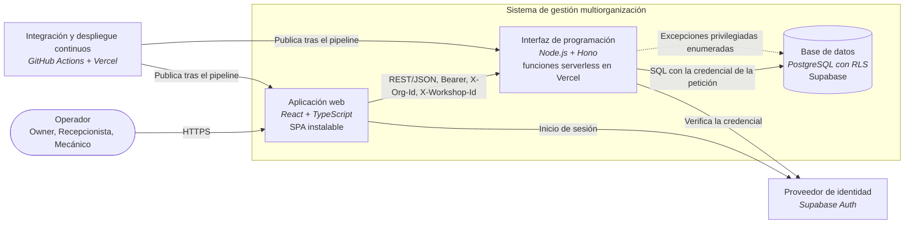
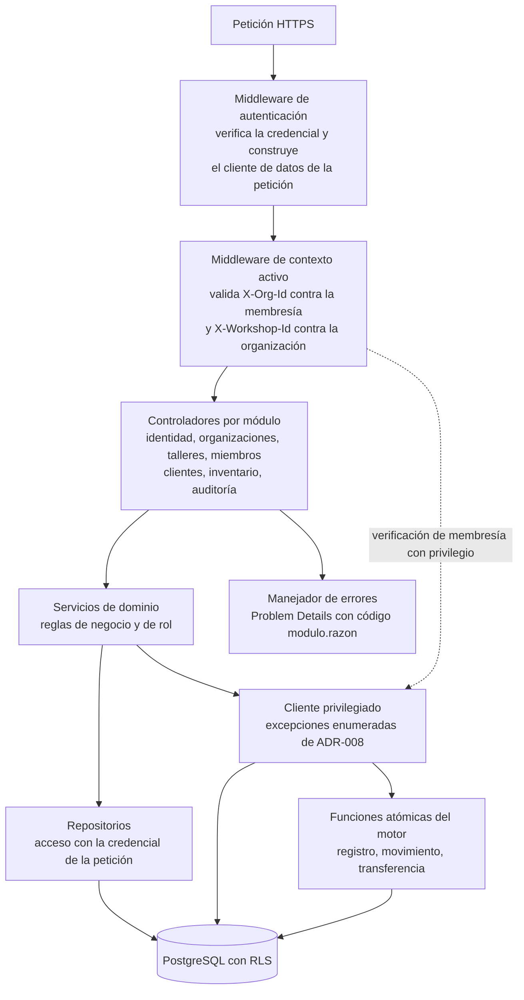

# Arquitectura

Diseño arquitectónico preliminar del sistema. Responde a los requisitos especificados en [02-requisitos.md](02-requisitos.md) —sobre todo a los no funcionales— y sus decisiones están registradas en [07-decisiones-diseno.md](07-decisiones-diseno.md).

> Terminología: [01-glosario.md](01-glosario.md); Interfaz que expone esta arquitectura: [10-contrato-api.md](10-contrato-api.md); Datos: [05-modelo-datos.md](05-modelo-datos.md); Seguridad: [06-seguridad.md](06-seguridad.md)

## 1. Selección del estilo arquitectónico

**Criterios de elección**: carga y concurrencia estimadas —muchas peticiones cortas de gestión interna, sin picos masivos—; mantenibilidad y facilidad de prueba; y equilibrio entre tiempo de entrega y escalabilidad, para un solo desarrollador en dieciséis semanas.

| Criterio | Monolito modular | Microservicios | Serverless por función |
|---|---|---|---|
| **Complejidad operativa** | Baja — un solo artefacto | Alta — orquestación y observabilidad distribuida | Media — una unidad por ruta |
| **Escalabilidad** | Vertical o réplicas completas | Horizontal por servicio | Automática por demanda |
| **Costo inicial** | Bajo, pero con servidor de costo fijo | Alto | Bajo, pago por uso |
| **Adecuado para** | MVP y alcance medio | Dominios amplios con varios equipos | Eventos e integración de APIs |

**Selección: monolito modular desplegado como funciones serverless** ([ADR-009](07-decisiones-diseno.md)). Una sola aplicación con módulos de dominio y capas internas, publicada como funciones con escalado a cero: conserva la baja complejidad del monolito y obtiene el costo por uso que exigen RNF-301 y RNF-302.

## 2. Modelo multiorganización jerárquico

La jerarquía tiene dos niveles y **un solo límite de seguridad**:

- **Cuenta**, que accede mediante una **membresía con rol** a la **organización**, unidad de aislamiento.
- **Taller**, subdivisión operativa dentro de la organización.

- La **organización** es la unidad de aislamiento. Toda entidad de negocio la referencia.
- Una cuenta puede pertenecer a **varias organizaciones**, con un rol distinto en cada una.
- Una organización puede tener **varios talleres**. El taller determina *dónde* ocurre una operación, no *quién* puede verla (ADR-006).
- El contexto activo —organización y, cuando corresponde, taller— se indica en cada petición y se valida contra la membresía (ADR-005).

Qué dato pertenece a qué nivel está fijado en el [Glosario](01-glosario.md).

## 3. Diagrama de contenedores (C4, nivel 2)

## 4. Diagrama de componentes de la interfaz de programación (C4, nivel 3)

**Acoplamiento y cohesión.** Los controladores solo conocen servicios; los servicios dependen de la **interfaz** de sus repositorios, no del cliente del proveedor; y la decisión de qué cliente de datos se usa se concentra en un único punto, el middleware de autenticación (ADR-008). Un módulo no invoca repositorios de otro módulo.

## 5. Capas y componentes

| Capa | Contenido | Responsabilidad |
|---|---|---|
| **Presentación** (cliente web) | SPA en React con TypeScript; enrutamiento; proveedor del contexto activo como componente contenedor; cliente HTTP que adjunta las cabeceras de contexto; sincronización y caché del estado de servidor con **TanStack Query**, con el contexto activo en la clave de consulta (ADR-010); manifiesto y *service worker* | Presentación, autenticación contra el proveedor de identidad, conservación del contexto activo y vigencia de los datos que muestra |
| **Negocio** (interfaz de programación) | Middlewares de autenticación y de contexto; controladores, servicios y repositorios por módulo; esquemas Zod como DTO de entrada; manejador de errores | Validación de la entrada, verificación de membresía y rol, reglas de negocio y el conjunto acotado de operaciones privilegiadas (ADR-007, ADR-008) |
| **Datos e infraestructura** | PostgreSQL con políticas de seguridad a nivel de fila; funciones de verificación de membresía; funciones atómicas; migraciones versionadas; Supabase Auth | Persistencia, integridad referencial, transacciones y aplicación de las políticas de aislamiento |

## 6. Patrones y principios

| Patrón o principio | Aplicación |
|---|---|
| **SOLID** | Responsabilidad única por servicio; inversión de dependencias: los servicios dependen de la interfaz del repositorio, no del cliente del proveedor |
| **Repository y DTO** | Los repositorios abstraen el acceso a datos; los esquemas Zod son los DTO de entrada, y de ellos se derivan los tipos |
| **Arquitectura limpia (transversal)** | Las reglas de dominio no dependen de Hono ni de Supabase; eso mitiga la dependencia del proveedor (riesgo R3) |
| **Container / Presenter** | En el cliente, el contexto activo vive en un componente contenedor y las vistas lo reciben |
| **Caché con clave de contexto** | El identificador de la organización activa —y el del taller, en datos de nivel taller— forma parte de la clave de consulta, de modo que un cambio de contexto no puede servirse desde la caché anterior (ADR-010) |
| **CQRS** | **No se aplica**: el rendimiento no exige separar lectura y escritura (RNF-501 fuera de alcance) |

## 7. Integración mediante APIs

| Mecanismo | Uso en el proyecto |
|---|---|
| **REST** | Mecanismo único entre cliente web e interfaz de programación: recursos, verbos explícitos y JSON ([Contrato](10-contrato-api.md)) |
| **GraphQL** | No se usa: las respuestas del corte vertical no presentan sobrecarga de datos que lo justifique |
| **WebSockets** | No se usa: no hay requisitos de tiempo real |
| **Orientado a eventos** | No se usa: no hay tareas pesadas que sacar del camino de la petición |

| Relación | Protocolo y contrato |
|---|---|
| Cliente web hacia el proveedor de identidad | HTTPS; inicio y renovación de sesión del proveedor |
| Cliente web hacia la interfaz de programación | HTTPS; REST/JSON; `Authorization: Bearer`; `X-Org-Id` y `X-Workshop-Id` ([Contrato](10-contrato-api.md), sección 2) |
| Interfaz de programación hacia el proveedor de identidad | Verificación de la credencial recibida |
| Interfaz de programación hacia la base de datos | Cliente de datos del proveedor sobre HTTPS, con la credencial de la petición; procedimientos remotos para las funciones atómicas |
| Pipeline hacia la plataforma de despliegue | Publicación de `main` en *staging* y de `release` en producción tras el pipeline |

## 8. Aislamiento de datos: defensa en profundidad

Dos capas independientes, ambas obligatorias (detalle en [06-seguridad.md](06-seguridad.md)):

1. **Seguridad a nivel de fila en el motor de base de datos** — las políticas exigen membresía activa en la organización propietaria del registro. Actúa aunque la capa de aplicación falle u omita un filtro.
2. **Verificación de membresía en la capa de aplicación** — cada operación valida la membresía y, cuando corresponde, el rol, antes de actuar, y devuelve un error de negocio específico.

Para que la primera capa actúe **también** sobre las peticiones de la interfaz, los datos de negocio se consultan con la credencial de quien llama, no con la del servidor (ADR-008). La verificación de la segunda capa es la excepción deliberada: consulta con privilegio, para no depender de la primera.

## 9. Persistencia

Base de datos **relacional** —PostgreSQL— con transacciones ACID, integridad referencial y políticas de seguridad a nivel de fila, construida mediante **migraciones versionadas** (RNF-304). No se incorpora almacenamiento documental ni capa de caché: los datos del corte vertical son estructurados y relacionales, y el rendimiento no exige caché. El modelo completo está en [05-modelo-datos.md](05-modelo-datos.md).

## 10. Seguridad por capas

| Capa | Aplicación |
|---|---|
| **Autenticación y autorización** | JWT emitido por el proveedor de identidad, verificado en cada petición, con renovación rotativa gestionada por el proveedor; control de acceso por rol **por organización** y políticas en el motor |
| **Transporte** | TLS/HTTPS en el cliente web, la interfaz y la base de datos; orígenes permitidos restringidos a los del cliente web en *staging* y producción |
| **OWASP Top 10 aplicable** | *Control de acceso roto*: dos capas de aislamiento; *Inyección*: consultas parametrizadas del cliente de datos y validación de entrada con Zod; *Fallos de identificación y autenticación*: identidad delegada, sin almacenamiento propio de contraseñas; *Componentes vulnerables*: auditoría de dependencias en el pipeline (RNF-208) |

La especificación de cada punto está en [Requisitos](02-requisitos.md), sección 5 y [Seguridad](06-seguridad.md).

## 11. Servicios externos y resiliencia

| Servicio | Uso | Ante su indisponibilidad |
|---|---|---|
| **Supabase Auth** | Identidad | Las peticiones responden `401` o `server.error`; no hay credenciales propias que usar como respaldo |
| **Supabase (PostgreSQL)** | Datos | La interfaz responde `server.error` sin exponer detalle interno; las operaciones compuestas son **atómicas en el motor** (ADR-007), de modo que una caída a mitad no deja estados intermedios |
| **Vercel** | Ejecución y publicación | El sistema no está disponible; la publicación se reintenta desde el repositorio |
| **GitHub** | Repositorio y pipeline | No se publica; el trabajo local continúa |

**Degradación controlada sin disyuntor.** No se introduce un patrón *circuit breaker*: cada dependencia tiene un único proveedor, no hay llamadas en cascada entre servicios que proteger, y las funciones efímeras no conservan estado entre invocaciones donde mantener un disyuntor abierto. La interfaz no reintenta escrituras, para no duplicarlas.

## 12. Matriz de selección tecnológica

La columna de **alternativas** es obligatoria: sin ella no hay justificación, solo preferencia. Criterios: naturaleza de la carga y escalabilidad, costo total de propiedad, curva de aprendizaje y disponibilidad de talento, y seguridad y madurez del ecosistema.

| Necesidad técnica | Alternativas | Seleccionada | Justificación |
|---|---|---|---|
| Lenguaje y entorno del servidor | Python (FastAPI), Java (Spring Boot), Node.js | **Node.js con TypeScript** | La carga es de entrada/salida —peticiones que esperan red y base de datos—; tipado compartido con el cliente; soporte nativo en la plataforma serverless (ADR-001) |
| Marco de la interfaz | Express, NestJS, rutas de API de Next.js, Hono | **Hono** | Diseñado para TypeScript y funciones efímeras; desacopla la interfaz del cliente web (ADR-003) |
| Validación de entrada | Joi, Yup, Zod | **Zod** | Deriva el tipo estático del esquema, sin dos definiciones paralelas |
| Base de datos relacional | MySQL, SQL Server, PostgreSQL | **PostgreSQL** | Seguridad a nivel de fila nativa y de código abierto; MySQL no la ofrece y SQL Server añade costo de licencia (ADR-002) |
| Datos e identidad gestionados | Firebase, PostgreSQL autogestionado con identidad propia, Supabase | **Supabase** | Identidad integrada y evaluable en las políticas; Firebase es documental y no ofrece seguridad a nivel de fila (ADR-004) |
| Despliegue | Servidor dedicado, AWS Lambda, Vercel | **Vercel** | Plataforma gestionada con escalado a cero y publicación desde el repositorio; Lambda exige configurar pasarela y permisos |
| Cliente web | Angular, Vue.js, Next.js, React | **React (SPA)** | La aplicación es interna y autenticada: el renderizado en servidor no aporta; ecosistema amplio y TypeScript compartido |
| Estado de servidor en el cliente: sincronización y caché | Estado propio de React con recarga manual, Redux Toolkit Query, SWR, TanStack Query | **TanStack Query** | La clave de consulta incorpora la organización y el taller activos, de modo que ningún cambio de contexto puede servirse desde la caché anterior; no impone un contenedor de estado global (ADR-010) |
| Pruebas unitarias y de integración | Jest, Mocha, Vitest | **Vitest** | Mismo ecosistema TypeScript y ESM, sin transpilación adicional |
| Pruebas extremo a extremo | Cypress, Selenium, Playwright | **Playwright** | Varios motores de navegador y anchos de pantalla en un solo ejecutor, sin interfaz gráfica en el pipeline |
| Calidad de código | TSLint (obsoleto), Biome, ESLint con Prettier | **ESLint + Prettier en *pre-commit*** | Estándar del ecosistema TypeScript; la calidad se automatiza antes de integrar |
| Integración y despliegue continuos | GitLab CI, Jenkins, GitHub Actions | **GitHub Actions** | Integrado con el repositorio, sin servidor propio que operar |

La definición formal de cada tecnología y la teoría que respalda su elección están en el [Marco teórico y conceptual](../anteproyecto/03-marco-teorico-y-conceptual.md).

## 13. Integración y despliegue continuos

1. **Antes de integrar**: ESLint y Prettier en *pre-commit*.
2. **Pipeline en cada integración a `main`**: verificación de tipos, pruebas N1, N2 y N6, cobertura ≥ 80 % y auditoría de dependencias. Un fallo bloquea la integración.
3. **Publicación en *staging***: pruebas N3 y N7 contra *staging*. Un fallo bloquea la promoción.
4. **Integración a `release`**: publicación en producción.

- **Git**: *trunk-based* con ramas cortas, adecuado a un solo desarrollador; `main` y `release` protegidas; versionado semántico en `release`.
- **CI** ejecuta verificación de tipos, pruebas automatizadas, cobertura y auditoría de dependencias en cada integración (RNF-201, RNF-203, RNF-207, RNF-208).
- **CD** publica automáticamente tras el pipeline (RNF-305). No hay imágenes de contenedor: la plataforma serverless empaqueta la aplicación, y el escaneo de vulnerabilidades se aplica a las dependencias.

Qué se ejecuta en cada nivel está en el [Plan de pruebas](11-plan-pruebas.md), sección 1.2.

## 14. Alcance de plataformas

La plataforma soportada es **web**, responsiva para escritorio y móvil (RNF-402) e instalable como aplicación web progresiva (RNF-403). Las aplicaciones nativas están **fuera del alcance** ([anteproyecto/01-definicion-y-alcance.md](../anteproyecto/01-definicion-y-alcance.md), sección 1.8.3).

## 15. Registros y observabilidad

Qué queda registrado cuando algo falla, dónde vive ese registro y qué no debe entrar en él.

**No confundir con el registro de auditoría** (sección 8): aquel es un **dato de negocio** —seis acciones críticas, de solo inserción, consultable por el `Owner` y conservado mientras exista la organización (RF-703, RF-704)—. Los registros de esta sección son **operativos**: sirven para diagnosticar fallos, no se exponen en la interfaz y su retención es la que ofrezca el plan del proveedor.

| Registro | Qué contiene | Dónde vive | Para qué se usa |
|---|---|---|---|
| **Errores del servidor** | Causa real del `server.error` con su traza, el código de negocio devuelto, la ruta y el identificador de la organización activa | Registros de ejecución de la plataforma serverless | Diagnosticar un `500`, cuyo detalle **nunca viaja al cliente** ([Contrato](10-contrato-api.md), sección 5) |
| **Invocaciones** | Ruta, método, código de estado y duración | Registros de ejecución de la plataforma serverless | Localizar fallos repetidos y confirmar que una publicación quedó operativa |
| **Base de datos** | Errores del motor, incluidas las denegaciones por política | Registros del proveedor de datos | Distinguir un fallo de aplicación de una denegación de aislamiento |
| **Pipeline** | Salida de tipos, pruebas, cobertura y auditoría de dependencias | Historial de ejecuciones de GitHub Actions | Evidencia de los KPI de calidad ([Plan de pruebas](11-plan-pruebas.md), sección 2) |

**Qué no se registra nunca**: contraseñas, cabeceras `Authorization`, credenciales del proveedor ni el contenido de filas de negocio. De la organización y del taller se registra su **identificador**, no su nombre; de la cuenta, su identificador, no su correo.

**Trazabilidad de un fallo.** El cliente recibe `server.error` sin detalle; la causa se localiza en los registros de ejecución por ruta y momento. Como en capa gratuita la retención la fija el proveedor y no es configurable, **toda salida que deba sostener un resultado de la validación se exporta y se conserva** con la evidencia ([Plan de pruebas](11-plan-pruebas.md), sección 6.6), en lugar de confiarse al registro del proveedor.

## 16. Salidas de esta etapa

| Salida | Dónde |
|---|---|
| Diagramas C4 de contenedores y componentes | Secciones 3 y 4 |
| Matriz de componentes | Sección 5 |
| Relaciones: protocolos, contratos y flujos de datos | Sección 7, [Contrato](10-contrato-api.md) |
| Justificación técnica | Secciones 1 y 12 y [Decisiones de diseño](07-decisiones-diseno.md) |
| Registros y observabilidad | Sección 15 |
