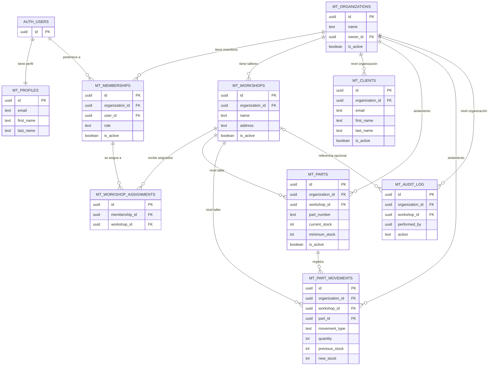

# Modelo de datos

Diseño de datos de la arquitectura multi-tenant jerárquica. Corresponde al objetivo específico **2**: diseñar el modelo jerárquico y especificar las políticas de aislamiento ([Definición y alcance](../anteproyecto/01-definicion-y-alcance.md), sección 1.7).

> Terminología: [Glosario](01-glosario.md); Decisión de fondo: [ADR-006](07-decisiones-diseno.md); Aislamiento: [Seguridad](06-seguridad.md)

## Diagrama entidad-relación

## Principio rector

**Toda tabla de negocio lleva `organization_id`**, incluidas las de nivel taller. Esto permite que las políticas de aislamiento se evalúen siempre sobre el mismo criterio, sin importar el nivel jerárquico del dato. Las tablas de nivel taller llevan **además** `workshop_id`.

## Tablas

### Identidad

| Tabla | Descripción | Claves y restricciones |
|---|---|---|
| `auth.users` | Gestionada por el proveedor de identidad. Identidad global de la cuenta. | PK `id` |
| `mt_profiles` | Datos de perfil, 1:1 con la cuenta. Se crea por disparador al registrarse. | PK `id` referencia a `auth.users(id)` en cascada |

### Jerarquía organizacional

| Tabla | Nivel | Claves y restricciones |
|---|---|---|
| `mt_organizations` | — (es el tenant) | PK `id`; `owner_id` referencia a `auth.users(id)`; índice por `owner_id` |
| `mt_workshops` | Organización | PK `id`; `organization_id` referencia a `mt_organizations(id)` en cascada; único `(organization_id, name)`; índice por `organization_id` |
| `mt_memberships` | Organización | PK `id`; **único `(organization_id, user_id)`**; **único parcial por `(organization_id)` donde `role = 'owner'` y la membresía está activa**; `role` restringido a `owner`, `mechanic`, `receptionist`; índice por `user_id` |
| `mt_workshop_assignments` | Organización | PK `id`; `organization_id` referencia a `mt_organizations(id)` en cascada; único `(membership_id, workshop_id)`; ambas FK en cascada; índice por `workshop_id` |

### Negocio — corte vertical

| Tabla | Nivel | Claves y restricciones |
|---|---|---|
| `mt_clients` | **Organización** | PK `id`; `organization_id` FK; **único `(organization_id, email)`**; índice por `organization_id` |
| `mt_parts` | **Taller** | PK `id`; `organization_id` + `workshop_id` FK; **único `(workshop_id, part_number)`**; índice por `(organization_id, workshop_id)` |
| `mt_part_movements` | **Taller** | PK `id`; `organization_id` + `workshop_id` + `part_id` FK; **inmutable** (solo inserción); índices por `part_id` y por fecha |
| `mt_audit_log` | **Organización** | PK `id`; `organization_id`; `workshop_id` nullable; `performed_by` **sin FK real**, para que el registro sobreviva al borrado del usuario |

### Convenciones comunes

- **Identificadores**: UUID generado por la base de datos.
- **Marcas de tiempo**: `created_at` con valor por defecto del servidor; `updated_at` nullable, gestionado por la aplicación.
- **Baja lógica**: `is_active` en las entidades que deben conservar historial (`mt_organizations`, `mt_workshops`, `mt_memberships`, `mt_clients`, `mt_parts`).
- **Historial inmutable**: `mt_part_movements` y `mt_audit_log` solo admiten inserción; nunca se actualizan ni se borran.

## Efecto de la jerarquía en las restricciones de unicidad

El nivel de cada entidad determina el ámbito de sus claves únicas — es la consecuencia más visible de ADR-006:

| Restricción | Ámbito | Consecuencia práctica |
|---|---|---|
| Email de cliente | `(organization_id, email)` | Dos organizaciones distintas pueden tener el mismo cliente. Dos talleres de la **misma** organización, no: es el mismo cliente. |
| Número de parte | `(workshop_id, part_number)` | La misma pieza puede existir en varios talleres, cada una con su propia existencia. |
| Miembro | `(organization_id, user_id)` | Una cuenta tiene un solo rol por organización, aunque trabaje en varios talleres. |
| Propietario | `(organization_id)` **donde el rol es `owner` y la membresía está activa** | Una organización tiene **un solo propietario vigente**. El predicado deja fuera las membresías inactivas, de modo que un traspaso de propiedad —hoy no contemplado— no chocaría con el histórico. |
| Nombre de taller | `(organization_id, name)` | No puede haber dos talleres con el mismo nombre en una organización. |

## Políticas de aislamiento (RLS)

**Censo de tablas de negocio.** Son **siete**, y todas activan Row Level Security: `mt_workshops`, `mt_memberships`, `mt_workshop_assignments`, `mt_clients`, `mt_parts`, `mt_part_movements` y `mt_audit_log`. Es el conjunto sobre el que se mide la cobertura de políticas (RNF-101) y el que recorre la verificación por acceso directo ([Plan de pruebas](11-plan-pruebas.md), sección 6.3).

Quedan **fuera del censo** las dos tablas que no son de negocio, cada una por un motivo distinto:

| Tabla | Por qué no entra en el censo | Cómo se protege |
|---|---|---|
| `mt_organizations` | **Es el tenant, no un dato del tenant.** No porta `organization_id`: lo define. Aplicarle el mismo patrón sería tautológico | Su lectura se limita a las organizaciones donde el solicitante tiene membresía activa (RF-202); la escritura, al `owner` (RF-204) |
| `mt_profiles` | **Es identidad, no negocio.** Un perfil pertenece a una cuenta, no a una organización, y la misma cuenta puede ser miembro de varias | Cada cuenta accede a su propio perfil; los datos de perfil de otros miembros se exponen solo a través del listado de miembros de la organización activa (RF-407) |

Ninguna de las dos contiene datos de negocio de una organización, de modo que su exclusión no abre una vía de acceso cruzado: lo que un miembro puede saber de otra organización a través de ellas es, como mucho, lo que ya afirmó al declarar su contexto.

Las políticas se apoyan en dos funciones auxiliares que se ejecutan con privilegios definidos por el creador, para evitar recursión al consultar `mt_memberships` desde una política:

| Función | Devuelve |
|---|---|
| `mt_is_org_member(org)` | Verdadero si la cuenta autenticada tiene membresía **activa** en esa organización |
| `mt_is_org_owner(org)` | Verdadero si además su rol es `owner` |

**Patrón aplicado**

| Operación | Regla |
|---|---|
| Lectura | `mt_is_org_member(organization_id)` — incluye el listado de miembros y de talleres (RF-302, RF-407) |
| Escritura de datos de negocio | `mt_is_org_member(organization_id)` + verificación de rol en la capa de aplicación |
| Escritura administrativa (crear, modificar o desactivar talleres; alta, cambio de rol y baja de miembros) | `mt_is_org_owner(organization_id)` |
| **Lectura del registro de auditoría** | `mt_is_org_owner(organization_id)` — es la única tabla cuya lectura no basta con ser miembro (RF-704) |
| **Inserción en el registro de auditoría** | **Reservada al servidor**: la escritura de auditoría es una de las excepciones enumeradas de [ADR-008](07-decisiones-diseno.md) y siempre ocurre con la credencial privilegiada. Apoyarla en `mt_is_org_member` dejaría que un miembro insertara entradas por acceso directo y falseara el registro, que es justamente lo que RF-703 debe impedir |

Las tablas de nivel taller usan **la misma condición sobre `organization_id`**: la pertenencia del `workshop_id` a la organización activa se valida en la API, no en la política. Esta separación mantiene las políticas simples y auditables (ver [ADR-006](07-decisiones-diseno.md)).

> **Por qué `mt_workshop_assignments` también porta `organization_id`.** Es un vínculo entre dos entidades que ya pertenecen a la organización, de modo que la columna es redundante en términos de integridad —y deliberadamente no lo es en términos de aislamiento—: sin ella, su política tendría que resolver el inquilino navegando hasta `mt_workshops`, lo que exigiría una función auxiliar adicional y rompería el principio rector de un criterio único. La redundancia se paga una vez en el modelo y se cobra en cada política.

## Reglas de negocio con impacto en los datos

| Regla | Descripción |
|---|---|
| Cálculo de existencias | `compra` y `devolucion` suman; `venta` y `merma` restan; `ajuste` **fija** un valor absoluto. La `transferencia` no se registra directamente: genera un movimiento de salida en el origen y uno de entrada en el destino (RF-608). Una operación que dejaría la existencia negativa se rechaza. |
| Atomicidad del movimiento | La inserción del movimiento y la actualización de la existencia del repuesto deben ocurrir en una sola transacción, resuelta dentro del motor de base de datos ([ADR-007](07-decisiones-diseno.md)). |
| Registro inicial de stock | Al crear un repuesto con existencia inicial mayor a cero, se genera automáticamente un movimiento de entrada que lo justifica. |
| Protección del propietario | No se puede cambiar el rol ni remover al `owner_id` de la organización, ni existir un segundo propietario activo. Las tres reglas se aplican en la capa de aplicación (RF-402, RF-405) y la última, además, en el motor mediante un índice único parcial: es la misma defensa en profundidad de [ADR-002](07-decisiones-diseno.md) aplicada a una regla de negocio. |
| Transferencia entre talleres | Genera dos movimientos vinculados (salida en origen, entrada en destino), ambos en la misma transacción y dentro de la misma organización ([ADR-007](07-decisiones-diseno.md)). |

## Índices: lo que la restricción ya provee

Una restricción `unique` o `primary key` **se implementa con un índice** sobre sus columnas, en el orden declarado. Declarar además un índice propio sobre esas mismas columnas —o sobre un prefijo de ellas— no acelera ninguna lectura y encarece cada escritura.

El caso que lo ilustra es `mt_memberships`, la tabla más consultada del esquema: sus dos funciones auxiliares se evalúan en toda política, sobre cada fila y en cada petición, filtrando por `(organization_id, user_id)`. Ese acceso **ya lo resuelve** el índice de la restricción única, sin declarar nada más.

| Índice | Origen | Para qué |
|---|---|---|
| `(organization_id, user_id)`, único | La restricción `unique` de la tabla | La comprobación de membresía — el acceso más frecuente del sistema |
| `(user_id)` | Declarado | «Las organizaciones de esta cuenta» (RF-202), que filtra solo por la **segunda** columna del índice anterior y por tanto no puede aprovecharlo |
| `(organization_id)` donde el rol es `owner` y está activa, único parcial | Declarado | No acelera: **impide** un segundo propietario activo |

La regla que se sigue de aquí, y que rige al añadir cualquier tabla: **antes de declarar un índice, comprobar si una restricción ya lo provee**. Un índice sobre el prefijo de otro es redundante; uno sobre su sufijo, no.

## Evolución del esquema

El esquema se construye mediante **migraciones versionadas** (RNF-304): cada archivo es aplicable de forma reproducible, lo que permite reconstruir la base desde cero y mantener alineados los entornos.

Son **cuatro**, agrupadas por tema y no por orden histórico —identidad y jerarquía, negocio, auditoría y permisos—, y su orden viene dado por las dependencias: el negocio y la auditoría necesitan las tablas y funciones de la primera, y los permisos se conceden sobre todo lo anterior. Agruparlas así, en lugar de acumular una migración por corrección, tiene una consecuencia que importa para la validación: **el archivo que define una tabla es también el que explica por qué está definida así**, sin que haya que reconstruir la intención leyendo un historial de enmiendas. El orden de construcción sigue la dependencia entre entidades —identidad y jerarquía primero, entidades de negocio después— y se detalla en el cronograma ([Plan de trabajo](08-plan-trabajo.md)).
